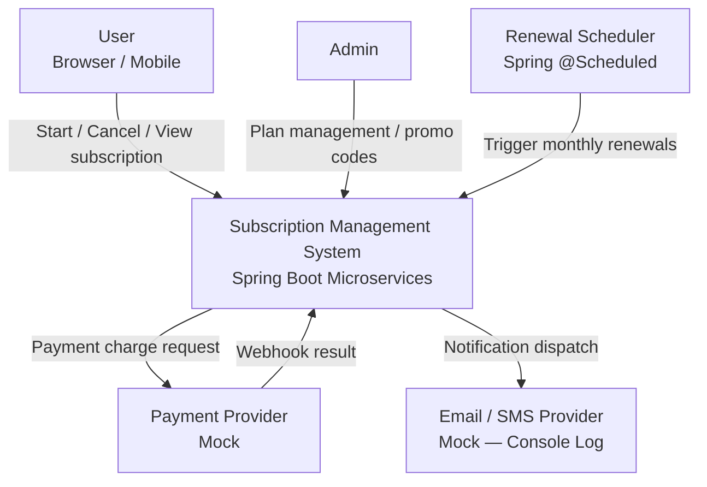
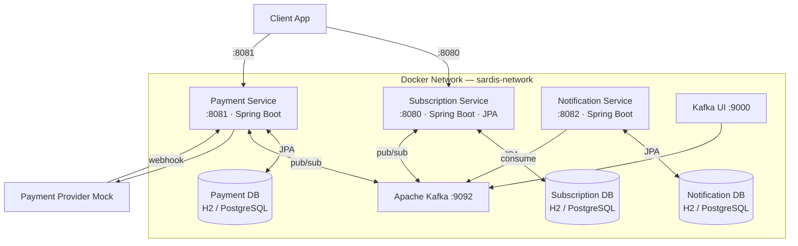
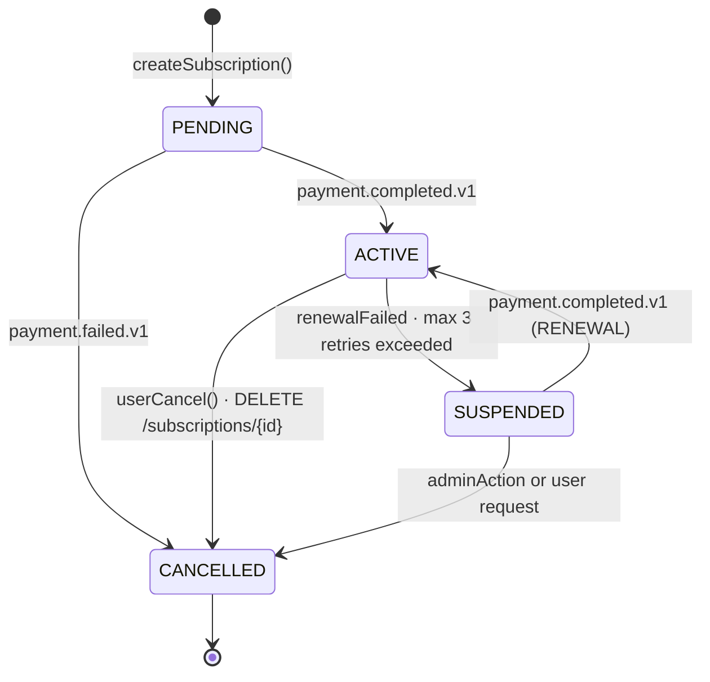
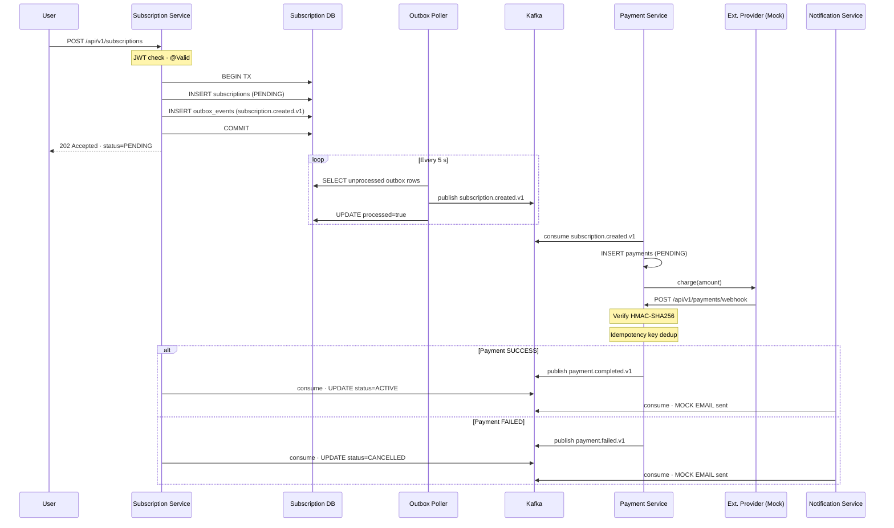
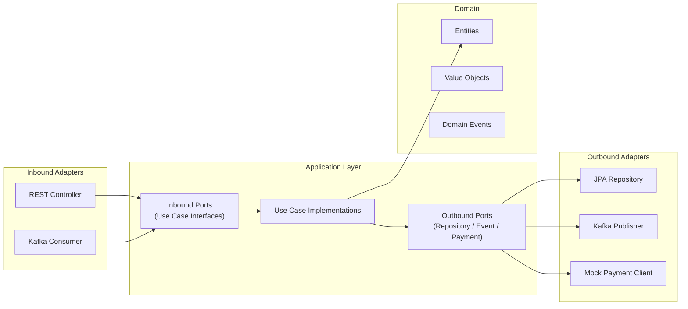
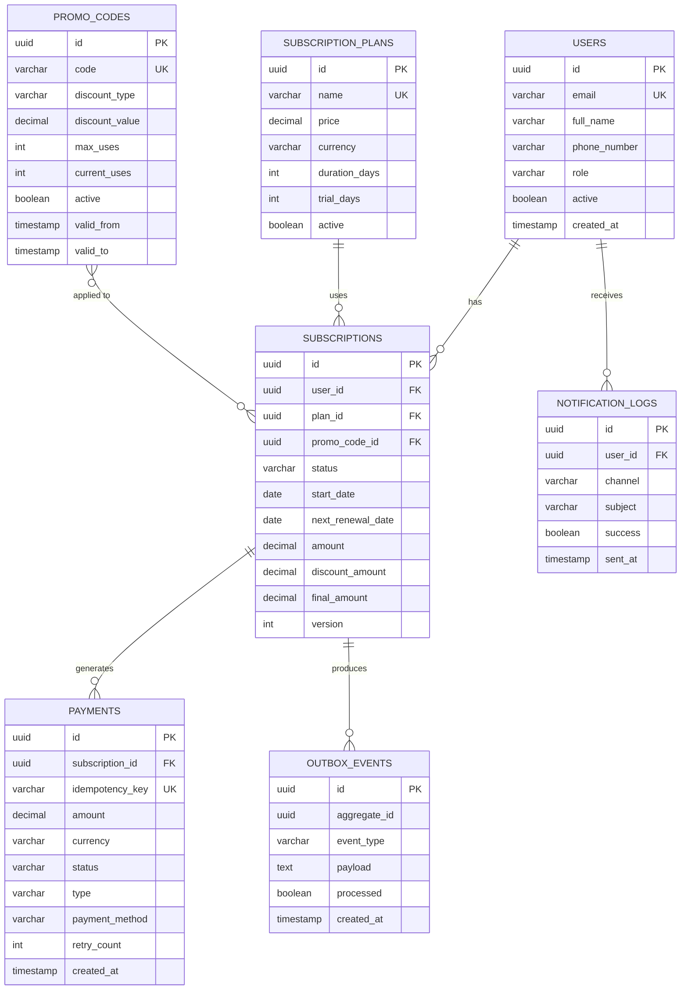

# mini-sardis — Subscription Management System

> A distributed subscription management system built with **Spring Boot 4**, **Apache Kafka**, and **Hexagonal Architecture** — designed for fault tolerance, idempotency, and production readiness.


---

## Overview

Users can start, renew, and cancel subscriptions with payments processed asynchronously via an external provider. The system guarantees consistency through **Saga Choreography** and the **Transactional Outbox Pattern** — even when downstream services are temporarily unavailable.

| Capability | Detail |
|---|---|
| Async payment | `202 Accepted` on creation; state updated via Kafka event |
| Payment gate | Subscription never activates before payment succeeds |
| Auto-renewal | Scheduler runs daily at 09:00; exponential backoff on failure |
| Fault tolerance | Outbox pattern + circuit breaker + retry (Resilience4j) |
| Idempotency | Webhook dedup via `idempotencyKey`; Kafka at-least-once safe |
| Security | JWT Bearer auth, HMAC-SHA256 webhook signature, no PII in logs |
| Promo codes | Percentage / fixed discounts, usage limits, date ranges, plan restrictions |

---

## Services

| Service | Port | Responsibility |
|---|---|---|
| `subscription-service` | `8080` | Subscription lifecycle, auth (JWT), plans, promo codes, renewal scheduler |
| `payment-service` | `8081` | Payment processing, webhook handling, idempotency, circuit breaker |
| `notification-service` | `8082` | Kafka consumer, mock email/SMS dispatch, notification log |
| `sardis-common` | — | Shared library: global exception handler, logging config |

---

## Architecture

### System Context



### Microservices & Infrastructure



### Subscription State Machine



### Subscription Creation — Saga Sequence



### Hexagonal Architecture (per service)



### Database Schema



---

## Kafka Topics

| Topic | Publisher | Consumer(s) |
|---|---|---|
| `subscription.created.v1` | Subscription Service | Payment Service |
| `subscription.activated.v1` | Subscription Service | Notification Service |
| `subscription.cancelled.v1` | Subscription Service | Notification Service |
| `subscription.failed.v1` | Subscription Service | Notification Service |
| `subscription.renewed.v1` | Subscription Service | Notification Service |
| `subscription.suspended.v1` | Subscription Service | Notification Service |
| `payment.completed.v1` | Payment Service | Subscription Service, Notification Service |
| `payment.failed.v1` | Payment Service | Subscription Service, Notification Service |
| `renewal.requested.v1` | Subscription Scheduler | Payment Service |

---

## Quick Start

```bash
# Full stack via Docker Compose
docker-compose up --build
```

```bash
# Individual services — dev profile (H2 in-memory, mock providers)
./gradlew :subscription-service:bootRun  --args='--spring.profiles.active=dev'
./gradlew :payment-service:bootRun       --args='--spring.profiles.active=dev'
./gradlew :notification-service:bootRun  --args='--spring.profiles.active=dev'
```

```bash
# Run all tests
./gradlew test

# Build without tests
./gradlew build -x test
```

### Developer URLs

| URL | Description |
|---|---|
| `http://localhost:8080/swagger-ui.html` | Swagger UI — Subscription Service |
| `http://localhost:8081/swagger-ui.html` | Swagger UI — Payment Service |
| `http://localhost:8082/swagger-ui.html` | Swagger UI — Notification Service |
| `http://localhost:8080/h2-console` | H2 DB Console (dev profile) |
| `http://localhost:9000` | Kafka UI |
| `http://localhost:8080/actuator/health` | Health check |

---

## Tech Stack

| Category | Technology | Rationale |
|---|---|---|
| Framework | Spring Boot 4.0.5 | Production-ready ecosystem |
| Language | Java 17 | LTS — records, text blocks, pattern matching |
| Database | H2 (dev/test) · PostgreSQL (prod) | Fast local dev + production parity |
| Migrations | Flyway | Versioned, deterministic schema |
| Messaging | Apache Kafka | Fan-out, event replay, at-least-once delivery |
| Architecture | Hexagonal (Ports & Adapters) | Domain isolated; adapters swappable |
| Distributed TX | Saga Choreography + Outbox | No dual-write problem |
| Mapper | MapStruct | Compile-time, zero reflection |
| Resilience | Resilience4j | Circuit breaker + retry + backoff |
| Security | Spring Security + jjwt | JWT Bearer, HMAC-SHA256 webhook |
| API Docs | SpringDoc OpenAPI 3.0.2 | Auto-generated Swagger UI |
| Shared Library | `sardis-common` | Exception handlers, logback config |
| Testing | JUnit 5 + Mockito + EmbeddedKafka | Unit → component coverage |
| Build | Gradle multi-module | Single root build for all services |
| Container | Docker + Docker Compose | Reproducible environment |

---

## Key Design Decisions

| Decision | Why |
|---|---|
| **Outbox Pattern** | DB state + Kafka event committed atomically — eliminates dual-write |
| **Saga Choreography** | Three services react to events; no central orchestrator needed |
| **`@Version` on Subscription** | Optimistic locking prevents concurrent cancel + renewal race |
| **No `setStatus()`** | State machine enforced inside domain entity; invalid transitions throw |
| **Hexagonal per service** | Domain is 100% unit-testable; adapters (JPA, Kafka, HTTP) are swappable |
| **Mock providers** | `NotificationPort` / `PaymentPort` — swap to SendGrid/Stripe without touching use cases |
| **H2 → PostgreSQL** | Same Flyway migrations run in both; only datasource config changes |
| **`sardis-common`** | Shared `GlobalExceptionHandlerBase` + `logback-spring.xml` loaded by all services |

---

## Documentation

### Project & Architecture

| Document | Description |
|---|---|
| [Subscription Service Overview](subscription-service/README.md) | Full system design with all Mermaid diagrams, state machine, saga sequence, ER diagram |
| [Architecture Decision Records](docs/architecture/ADR.md) | 10 ADRs — microservices, hexagonal, Kafka, outbox, idempotency, JWT, MapStruct, and more |

### Service Design

| Document | Description |
|---|---|
| [Subscription Service Design](subscription-service/docs/README.md) | Hexagonal layout, domain model, state machine, Flyway migrations, Kafka topics |
| [Payment Service Design](payment-service/docs/README.md) | Payment flow, webhook signature verification, circuit breaker, retry logic |
| [Notification Service Design](notification-service/docs/README.md) | Kafka consumer setup, mock email/SMS adapters, notification log |

### API & Testing

| Document | Description |
|---|---|
| [API cURL Reference](docs/api-curl-reference.md) | Ready-to-run curl commands for all 13 endpoints; Postman import guide; HMAC signature helper scripts; end-to-end flow |

### Security & Deployment

| Document | Description |
|---|---|
| [Security Design](docs/security/README.md) | JWT authentication flow, role-based access control, webhook HMAC-SHA256 verification |
| [Deployment Guide](docs/deployment/README.md) | Docker Compose configuration, environment variables, demo walkthrough, troubleshooting |

---

## Project Structure

```
mini-sardis/
├── sardis-common/                   # Shared library (exception handler, logback config)
├── subscription-service/            # Port 8080 — lifecycle, auth, plans, promo codes
│   ├── src/main/java/.../
│   │   ├── domain/                  # Pure Java — entities, value objects, events
│   │   ├── application/             # Use cases, port interfaces
│   │   └── infrastructure/          # REST, Kafka, JPA, security, Flyway
│   └── src/test/java/.../
│       ├── application/service/     # Unit tests (Mockito, no Spring)
│       └── infrastructure/adapter/  # Component tests (SpringBootTest + EmbeddedKafka)
├── payment-service/                 # Port 8081 — payments, webhook, idempotency
├── notification-service/            # Port 8082 — Kafka consumer, email/SMS log
├── docs/
│   ├── api-curl-reference.md        # curl / Postman reference for all endpoints
│   ├── architecture/ADR.md          # Architecture Decision Records
│   ├── security/README.md           # Security design
│   └── deployment/README.md         # Deployment guide
└── docker-compose.yml
```

---

> **Author:** Ahmet Özyılmaz &nbsp;·&nbsp; mini-sardis &nbsp;·&nbsp; Turkcell Case Study
