# Abonelik Yönetim Sistemi – PRD
# Subscription Management System – PRD

> **Versiyon / Version:** 1.0 | **Tarih / Date:** 2026-04-24 | **Durum / Status:** Draft  
> **Yazar / Author:** Ahmet Özyılmaz | **Proje / Project:** mini-sardis / subscription-service

---

## İçindekiler / Table of Contents

1. [Amaç ve Kapsam / Purpose & Scope](#1-amaç-ve-kapsam--purpose--scope)
2. [İş Problemi / Business Problem](#2-iş-problemi--business-problem)
3. [İş Akışı ve Senaryolar / Business Flows](#3-iş-akışı-ve-senaryolar--business-flows)
4. [Mimari Diyagramlar / Architecture Diagrams](#4-mimari-diyagramlar--architecture-diagrams)
5. [Mimari Yaklaşım / Architectural Approach](#5-mimari-yaklaşım--architectural-approach)
6. [Sistem Servisleri & Kafka Akışları / Core Services & Kafka Flows](#6-sistem-servisleri--kafka-akışları--core-services--kafka-flows)
7. [Veri Modeli & Flyway Migrasyonları / Data Model & Flyway Migrations](#7-veri-modeli--flyway-migrasyonları--data-model--flyway-migrations)
8. [API Tasarımı / API Design](#8-api-tasarımı--api-design)
9. [Güvenlik & NFR / Security & Non-Functional Requirements](#9-güvenlik--nfr--security--non-functional-requirements)
10. [Test Stratejisi / Testing Strategy](#10-test-stratejisi--testing-strategy)
11. [Demo Verisi / Demo Data Bootstrap](#11-demo-verisi--demo-data-bootstrap)
12. [Teknik Beklentiler / Technical Expectations](#12-teknik-beklentiler--technical-expectations)
13. [Dokümantasyon / Documentation Expectations](#13-dokümantasyon--documentation-expectations)
14. [Teslimatlar / Deliverables](#14-teslimatlar--deliverables)
15. [Kapsam Dışı / Out of Scope](#15-kapsam-dışı--out-of-scope)
16. [Varsayımlar / Assumptions](#16-varsayımlar--assumptions)
17. [Sözlük / Glossary](#17-sözlük--glossary)
18. [Promosyon Kodu / Promo Code Feature](#18-promosyon-kodu--promo-code-feature)

---

## 1. Amaç ve Kapsam / Purpose & Scope

### TR — Amaç

Bu çalışmanın amacı, adayın aşağıdaki yetkinliklerini ölçmektir:

| Yetkinlik | Beklenti |
|-----------|----------|
| Dağıtık sistem tasarımı | Mikroservis + mesaj kuyruğu + saga deseni |
| Yazılım geliştirme | Clean code, SOLID, OOP, hexagonal mimari |
| Dokümantasyon kalitesi | ADR, mimari diyagramlar, API belgesi |
| Operasyonel farkındalık | Loglama, sağlık kontrolü, graceful shutdown |
| Güvenli kodlama | JWT, HMAC, input validation, no PII in logs |
| Üretim ortamı düşüncesi | Docker, resilience, retry, circuit breaker |

Case, gerçek hayatta kullanılan abonelik yönetim sistemleri temel alınarak hazırlanmıştır. Adaydan; yalnızca çalışan bir çözüm değil, **ölçeklenebilir, hataya dayanıklı ve gerekçelendirilmiş** bir sistem tasarlaması beklenmektedir.

### EN — Purpose

The goal of this case study is to evaluate the candidate's competencies in:

| Competency | Expectation |
|-----------|-------------|
| Distributed system design | Microservices, message queue, saga pattern |
| Software development | Clean code, SOLID, OOP, hexagonal architecture |
| Documentation quality | ADR, architecture diagrams, API documentation |
| Operational awareness | Logging, health checks, graceful shutdown |
| Secure coding | JWT, HMAC, input validation, no PII in logs |
| Production thinking | Docker, resilience, retry, circuit breaker |

The candidate is expected to deliver not just a working solution, but a **scalable, fault-tolerant, and well-justified** system design.

---

## 2. İş Problemi / Business Problem

### TR — İş İhtiyaçları

Şirketimiz, kullanıcıların kredi kartı ile ödeme yaparak abonelik başlatabildiği, yenileyebildiği ve iptal edebildiği bir dijital servis sunmaktadır.

| Gereksinim | Detay |
|------------|-------|
| Abonelik planları | Kullanıcılar farklı planlar arasından seçim yapabilmelidir |
| Asenkron ödeme | Ödemeler harici bir sağlayıcı üzerinden asenkron yürütülmelidir |
| Ödeme önceliği | Ödeme başarılı olmadan abonelik aktif hale gelmemelidir |
| Tutarlılık | Başarısız ödemelerde sistem tutarlı kalmalı, kullanıcı bilgilendirilmelidir |
| Otomatik yenileme | Abonelikler aylık otomatik yenilenmelidir |
| Yüksek trafik | Gecikmeli yanıtlar ve kısmi hataları sisteme dahil etmelidir |
| Promosyon kodları | Admin belirli bir süre geçerli indirim kodu tanımlayabilmeli; kullanıcı abonelik başlatırken kodu uygulayabilmeli |

**Tahmini ölçek:** ~100K aktif kullanıcı, günlük ~10K yeni abonelik, aylık ~500K yenileme işlemi.

### EN — Business Requirements

| Requirement | Detail |
|-------------|--------|
| Subscription plans | Users can choose from multiple subscription plans |
| Async payment | Payments processed asynchronously via external provider |
| Payment gate | Subscription cannot activate before payment succeeds |
| Consistency | Failed payments leave system consistent; user notified |
| Auto-renewal | Active subscriptions renew automatically each month |
| High availability | System must tolerate delays and partial service failures |
| Promo codes | Admin defines time-limited discount codes; user applies code at subscription creation |

---

## 3. İş Akışı ve Senaryolar / Business Flows

### 3.1 Abonelik Başlatma / Subscription Start

**TR:**
1. Kullanıcı bir abonelik planı seçer ve ödeme başlatır.
2. Ödeme talebi Payment Service tarafından asenkron işlenir.
3. Kullanıcıya **"Aboneliğiniz oluşturuluyor"** bilgisi verilir (HTTP 202).
4. Ödeme sonucu:
   - **Başarılı** → Abonelik `ACTIVE` duruma geçer, kullanıcı bilgilendirilir.
   - **Başarısız** → Abonelik `CANCELLED` olur, kullanıcı bilgilendirilir, hata loglanır.

**EN:**
1. User selects a plan and initiates payment.
2. Payment request is processed asynchronously by Payment Service.
3. User receives **"Your subscription is being created"** (HTTP 202).
4. Payment result:
   - **Success** → Subscription transitions to `ACTIVE`, user notified.
   - **Failure** → Subscription cancelled, user notified, error logged.

### 3.2 Abonelik İptali / Subscription Cancellation

**TR:**
- Kullanıcı aktif aboneliğini istediği zaman iptal edebilir.
- İptal anında abonelik `CANCELLED` duruma geçer.
- İptal edilen dönem için ek ücret tahsil edilmez.
- İptal işlemi geri alınamaz (yeni abonelik başlatılması gerekir).

**EN:**
- User can cancel their active subscription at any time.
- Subscription transitions to `CANCELLED` immediately.
- No additional charges for the current period.
- Cancellation is irreversible; a new subscription must be started.

### 3.3 Periyodik Yenileme / Periodic Renewal

**TR:**
- Aktif abonelikler için aylık otomatik ödeme alınır.
- Scheduler her gün 09:00'da vadesi gelen abonelikleri bulur.
- Ödeme başarılıysa: `nextRenewalDate` uzatılır, abonelik `ACTIVE` kalır.
- Ödeme başarısızsa: Max 3 deneme (1s → 2s → 4s backoff) sonra abonelik `SUSPENDED` olur.

**EN:**
- Monthly automatic payment for all active subscriptions.
- Scheduler runs daily at 09:00 to find due renewals.
- Payment success: `nextRenewalDate` extended, subscription stays `ACTIVE`.
- Payment failure: After max 3 retries (exponential backoff), subscription becomes `SUSPENDED`.

### 3.5 Promosyon Kodu Uygulaması / Promo Code Redemption

**TR:**
1. Kullanıcı abonelik başlatırken isteğe bağlı `promoCode` alanını iletir.
2. Sistem kodu doğrular: aktif mi, süresi dolmamış mı, kullanım limiti aşılmamış mı?
3. Geçerli kod → `discountAmount` hesaplanır, aboneliğe anlık fiyat snapshot'ı olarak kaydedilir.
4. Ödeme servisi, `finalAmount` (indirilmiş tutar) üzerinden ödeme alır.
5. Kod kullanım sayacı (`currentUses`) +1 artırılır — abonelik kaydetme ile aynı DB transaction'ında gerçekleşir.
6. Geçersiz/süresi dolmuş kod → 400 `InvalidPromoCode` hatası, abonelik oluşturulmaz.
7. Promo kodu yalnızca ilk abonelikte geçerlidir; yenileme işlemlerine uygulanmaz.

**EN:**
1. User optionally provides `promoCode` in the subscription creation request.
2. System validates: active, within date range, usage limit not exceeded.
3. Valid code → `discountAmount` computed and snapshotted onto the subscription record.
4. Payment service charges `finalAmount` (discounted amount).
5. Usage counter (`currentUses`) incremented atomically within the same DB transaction as subscription save.
6. Invalid/expired code → 400 `InvalidPromoCode` error, no subscription created.
7. Promo codes apply to initial subscriptions only; renewals are not discounted.

### 3.4 Ödeme Başarısız Senaryosu / Payment Failure Scenarios

| Senaryo / Scenario | Sonuç / Result | Bildirim / Notification |
|-------------------|----------------|------------------------|
| İlk ödemede hata | `PENDING → CANCELLED` | Email: "Abonelik oluşturulamadı" |
| Yenileme hatası (max retry) | `ACTIVE → SUSPENDED` | Email + SMS: "Ödeme alınamadı" |
| Sonraki başarılı yenileme | `SUSPENDED → ACTIVE` | Email: "Aboneliğiniz yenilendi" |

---

## 4. Mimari Diyagramlar / Architecture Diagrams

### 4.1 C4 — Sistem Bağlamı / C4 Context Diagram

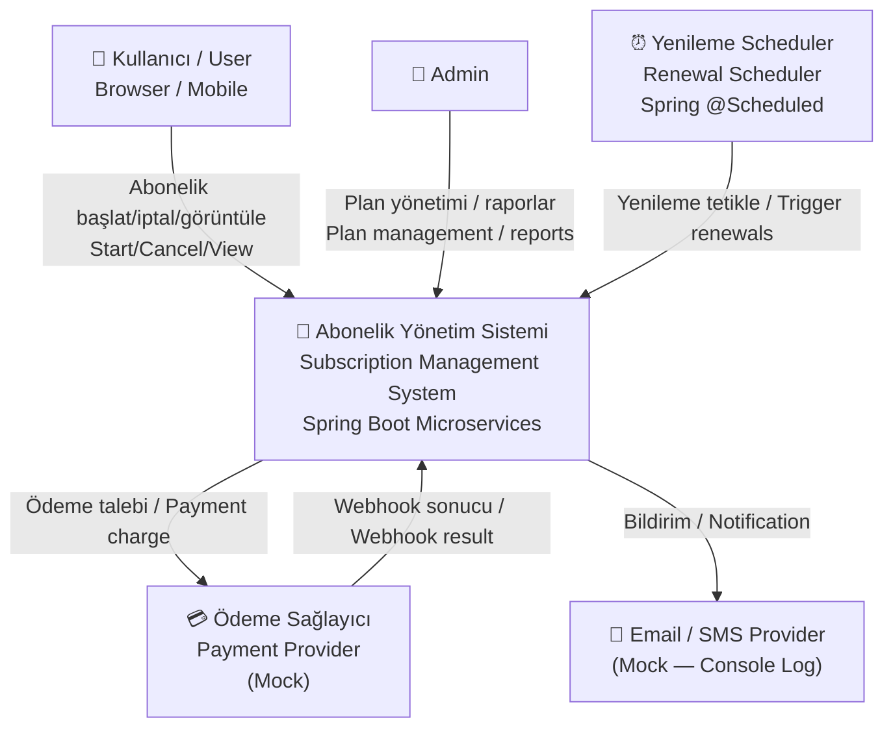

### 4.2 C4 — Konteyner Diyagramı / C4 Container Diagram

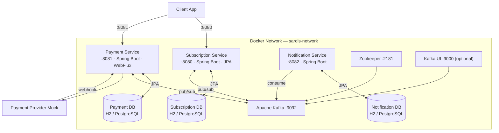

### 4.3 Kullanım Senaryosu Diyagramı / Use Case Diagram

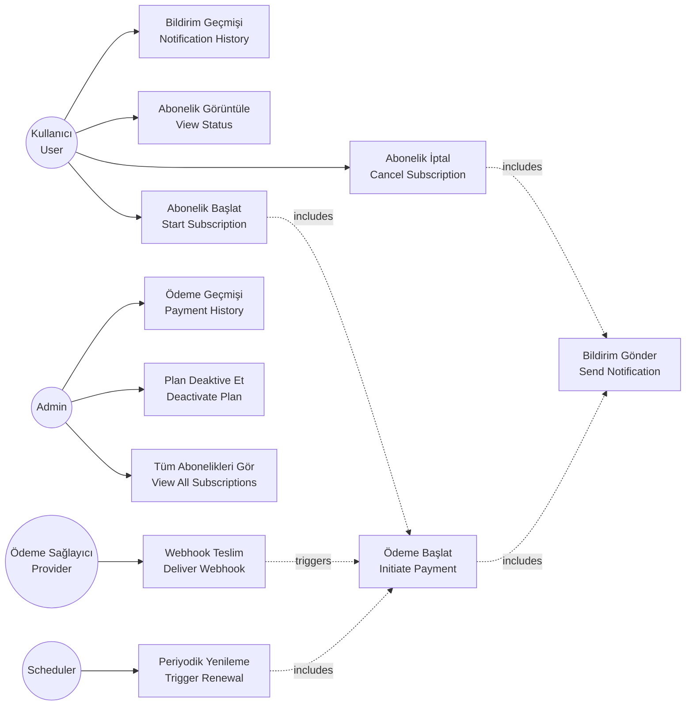

### 4.4 Hexagonal Mimari / Hexagonal Architecture (per Service)

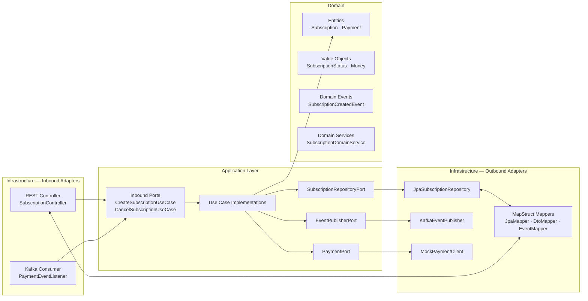

### 4.5 Alan Sınıfı Diyagramı / Domain Class Diagram

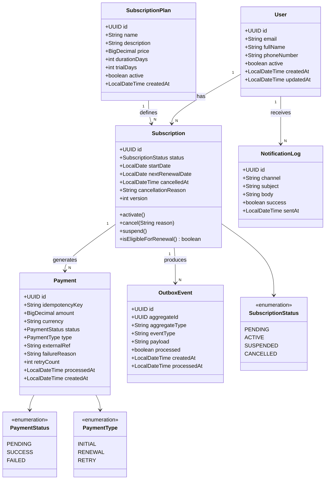

### 4.6 Veritabanı ER Diyagramı / Database ER Diagram

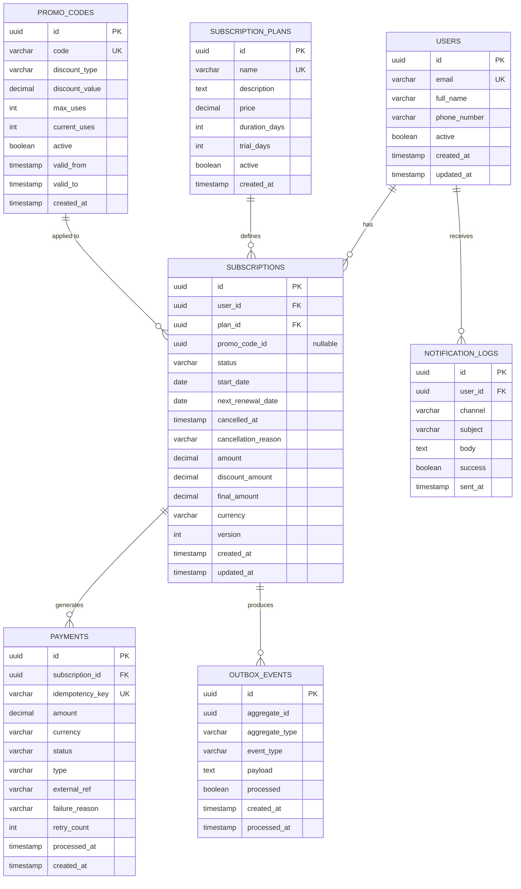

### 4.7 Abonelik Başlatma — Saga Sequence Diyagramı

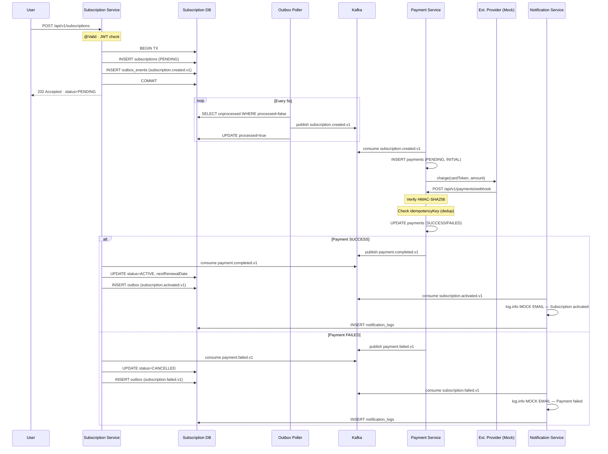

### 4.8 Abonelik Durum Makinesi / Subscription State Machine

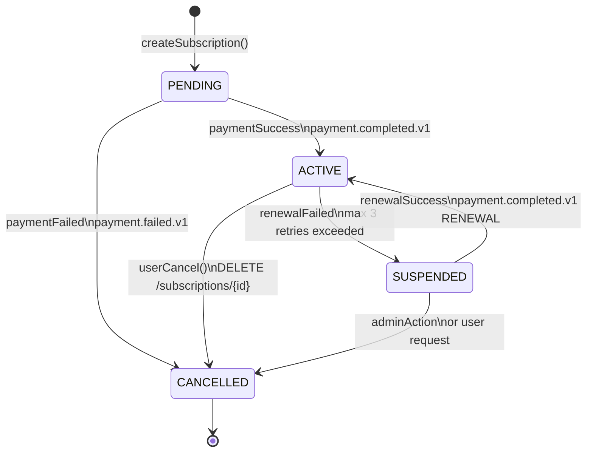

### 4.9 Periyodik Yenileme — Sequence Diyagramı / Renewal Sequence

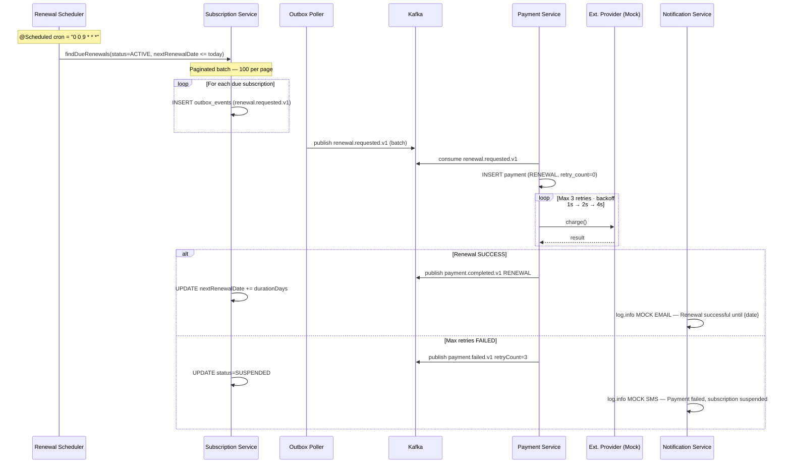

### 4.10 Deployment Diyagramı / Deployment Diagram

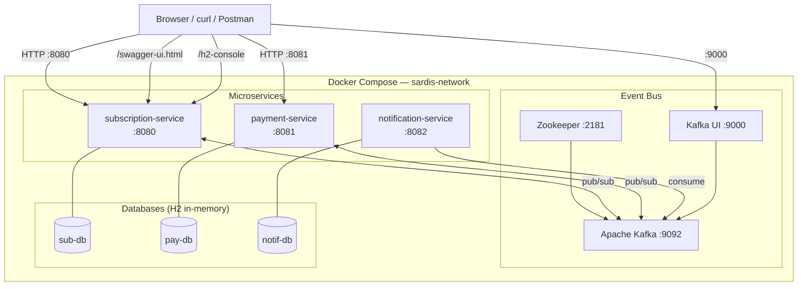

---

## 5. Mimari Yaklaşım / Architectural Approach

### 5.1 Neden Mikroservis? / Why Microservices?

| Gerekçe | Açıklama |
|---------|----------|
| **Bağımsız ölçekleme** | Payment Service yoğun ödeme dönemlerinde ayrı scale edilebilir |
| **Hata izolasyonu** | Notification Service çökse de abonelik işlemleri devam eder |
| **Bağımsız deploy** | Payment Service bug fix'i diğer servisleri etkilemez |
| **Teknoloji esnekliği** | Her servis kendi DB ve runtime config'ini yönetir |

| Rationale | Explanation |
|-----------|-------------|
| **Independent scaling** | Payment Service can scale independently during peak billing periods |
| **Fault isolation** | Notification failure does not block subscription operations |
| **Independent deployment** | Payment Service bug fixes don't require redeployment of others |
| **Technology flexibility** | Each service owns its schema, DB config, and release cycle |

> **Mevcut durum / Current state:** Proje tek bir Spring Boot modülü olarak başlatılmıştır. Servislerin iç mimarisi hexagonal düzende kurgulanmış olup, ilerleyen aşamalarda bağımsız modüllere ayrılabilir.  
> **Current state:** The project starts as a single Spring Boot module. Internal structure follows hexagonal architecture — services can be extracted into independent modules in a later phase.

---

### 5.2 Neden Hexagonal Mimari? / Why Hexagonal Architecture?

| Gerekçe | Açıklama |
|---------|----------|
| **Domain saflığı** | İş mantığı Spring, JPA, Kafka bağımlılıklarından izole |
| **Test edilebilirlik** | Domain ve use case sınıfları Spring context olmadan test edilir |
| **Adapter değişimi** | Kafka → RabbitMQ veya H2 → PostgreSQL, domain kodu değişmez |

| Rationale | Explanation |
|-----------|-------------|
| **Domain purity** | Business logic isolated from Spring, JPA, Kafka dependencies |
| **Testability** | Domain and use case classes tested without Spring context |
| **Adapter swappability** | Swap Kafka → RabbitMQ or H2 → PostgreSQL without touching domain |

---

### 5.3 Paket Yapısı / Package Structure (per service)

```
com.mini.sardis.
├── domain/
│   ├── entity/          ← Subscription, SubscriptionPlan, Payment (pure Java)
│   ├── value/           ← SubscriptionStatus, Money, PlanId (immutable VOs)
│   ├── event/           ← SubscriptionCreatedEvent, PaymentCompletedEvent
│   └── service/         ← SubscriptionDomainService (no Spring deps)
│
├── application/
│   ├── port/
│   │   ├── in/          ← CreateSubscriptionUseCase, CancelSubscriptionUseCase (interfaces)
│   │   └── out/         ← SubscriptionRepositoryPort, EventPublisherPort, PaymentPort
│   └── service/         ← Use case implementations (orchestrate domain + ports)
│
└── infrastructure/
    ├── adapter/
    │   ├── in/
    │   │   ├── web/     ← SubscriptionController (@RestController)
    │   │   ├── kafka/   ← PaymentEventListener (@KafkaListener)
    │   │   └── mapper/  ← SubscriptionRequestMapper, SubscriptionResponseMapper (MapStruct)
    │   └── out/
    │       ├── jpa/     ← JpaSubscriptionRepository, SubscriptionJpaEntity
    │       ├── kafka/   ← KafkaEventPublisher
    │       ├── payment/ ← MockPaymentClient
    │       └── mapper/  ← SubscriptionJpaMapper, PaymentJpaMapper (MapStruct)
    ├── config/          ← SecurityConfig, OpenAPIConfig, KafkaConfig, CacheConfig
    └── persistence/     ← Flyway migrations (db/migration/)
```

---

### 5.4 Mapper Tasarımı / Mapper Design (MapStruct)

Mapperlar saf altyapı katmanı sorunudur — domain nesneleri DTO veya JPA entity'den haberdar değildir.

| Mapper | Konum / Location | Dönüşüm / Converts |
|--------|-----------------|---------------------|
| `SubscriptionRequestMapper` | `adapter/in/mapper/` | REST DTO → Domain Command |
| `SubscriptionResponseMapper` | `adapter/in/mapper/` | Domain Entity → REST DTO |
| `SubscriptionJpaMapper` | `adapter/out/mapper/` | Domain Entity ↔ JPA Entity |
| `PaymentJpaMapper` | `adapter/out/mapper/` | Domain Payment ↔ JPA Payment |
| `SubscriptionEventMapper` | `adapter/out/mapper/` | Domain → Kafka Event DTO |

```java
@Mapper(componentModel = "spring")
public interface SubscriptionJpaMapper {
    SubscriptionJpaEntity toJpa(Subscription domain);
    Subscription toDomain(SubscriptionJpaEntity jpa);
}
```

**Neden MapStruct / Why MapStruct:**
- Compile-time kod üretimi — sıfır runtime reflection
- Eksik alan eşlemelerinde compile hatası — erken hata tespiti
- `@Mapper(componentModel = "spring")` ile Spring DI entegrasyonu

---

### 5.5 SOLID Prensipleri / SOLID Principles Applied

| Prensip | Uygulama |
|---------|----------|
| **S — Single Responsibility** | Her use case sınıfı tek bir işlem yapar: `CreateSubscriptionUseCase`, `CancelSubscriptionUseCase`, `RenewSubscriptionUseCase` |
| **O — Open/Closed** | Yeni bildirim kanalı eklemek için `PushNotificationAdapter implements NotificationPort` — mevcut kod değişmez |
| **L — Liskov Substitution** | `JpaSubscriptionRepository implements SubscriptionRepositoryPort` — test `InMemorySubscriptionRepository` ile değiştirilebilir |
| **I — Interface Segregation** | `SubscriptionRepositoryPort` (write) ayrı, `SubscriptionQueryPort` (read) ayrı — use case yalnızca ihtiyacını inject eder |
| **D — Dependency Inversion** | Use case'ler interface'lere (port) bağımlı, JPA/Kafka adapter'larına değil |

### 5.6 OOP Desenleri / OOP Patterns

| Desen / Pattern | Uygulama / Where |
|----------------|-----------------|
| **Factory Method** | `Subscription.create(userId, planId)` — invariant doğrulaması yapılır |
| **Value Object** | `SubscriptionStatus`, `Money`, `PlanId` — immutable, değer eşitliği |
| **State Machine** | `subscription.activate()`, `cancel()`, `suspend()` — geçersiz geçişte exception |
| **Strategy** | `NotificationPort` — EmailAdapter / SmsAdapter / future PushAdapter |
| **Adapter** | Tüm `infrastructure/adapter/` sınıfları — domain ile dış teknoloji arasında köprü |
| **Builder** | Lombok `@Builder` DTO ve JPA entity'lerde |

**Kapsülleme kuralı / Encapsulation rule:** `Subscription` domain entity'nin public `setStatus()` metodu yoktur. Durum değişimleri yalnızca `activate()`, `cancel()`, `suspend()` metodlarıyla gerçekleşir ve state machine kurallarını uygular.

---

### 5.7 Kafka Konu Tasarımı / Kafka Topic Design

**Naming convention:** `{service}.{domain-event}.{version}`

| Konu / Topic | Yayıncı / Publisher | Tüketiciler / Consumers |
|-------------|--------------------|-----------------------|
| `subscription.created.v1` | Subscription Service | Payment Service |
| `subscription.activated.v1` | Subscription Service | Notification Service |
| `subscription.cancelled.v1` | Subscription Service | Notification Service |
| `subscription.failed.v1` | Subscription Service | Notification Service |
| `payment.completed.v1` | Payment Service | Subscription Service, Notification Service |
| `payment.failed.v1` | Payment Service | Subscription Service, Notification Service |
| `renewal.requested.v1` | Subscription Scheduler | Payment Service |

### 5.8 Dağıtık Transaction Desenleri / Distributed Transaction Patterns

**Saga (Choreography)** — abonelik başlatma ve yenileme akışlarında:
- Her servis kendi local transaction'ını yönetir
- Sonucu Kafka event olarak yayınlar
- Hata durumunda compensating transaction (PENDING → CANCELLED)
- 3 servis için choreography yeterli — orchestrator gereksiz karmaşıklık ekler

**Outbox Pattern** — event yayının güvencesi:
- Domain event + outbox kaydı aynı DB transaction'ında yazılır
- OutboxPoller (her 5 saniye) işlenmemiş kayıtları Kafka'ya yayınlar
- "DB write başarılı, Kafka publish başarısız" senaryosu engellenir
- At-least-once garantisi — tüketiciler idempotent olmalıdır (idempotencyKey ile sağlanır)

---

## 6. Sistem Servisleri & Kafka Akışları / Core Services & Kafka Flows

### 6.1 Servis Sorumlulukları / Service Responsibilities

| Servis | Sorumluluklar |
|--------|--------------|
| **Subscription Service** | CRUD, state machine, renewal scheduler, outbox publisher |
| **Payment Service** | Async charge, webhook handler, idempotency key check, retry + circuit breaker |
| **Notification Service** | Kafka consumer, mock email/SMS log output, notification history |

### 6.2 İlk Abonelik Ödeme Akışı (Adım Adım) / Initial Payment Flow

```
Adım 1 — User action
  POST /api/v1/subscriptions {userId, planId, cardToken}
  ↓ @Valid doğrulama, JWT kimlik doğrulama

Adım 2 — Subscription Service (tek DB tx)
  INSERT subscriptions (status=PENDING)
  INSERT outbox_events (subscription.created.v1, processed=false)
  → COMMIT
  → HTTP 202 {subscriptionId, status: "PENDING", message: "Aboneliğiniz oluşturuluyor"}

Adım 3 — OutboxPoller (@Scheduled every 5s)
  SELECT * FROM outbox_events WHERE processed=false LIMIT 100
  publish → Kafka: subscription.created.v1
  UPDATE outbox_events SET processed=true

Adım 4 — Payment Service (Consumer Group: payment-subscription-processor)
  INSERT payments (PENDING, INITIAL, idempotency_key=UUID)
  CALL MockExternalPaymentProvider.charge()

Adım 5 — Webhook (POST /api/v1/payments/webhook)
  Verify HMAC-SHA256 signature
  SELECT payment WHERE idempotency_key=? → if processed → return 200 (no-op)
  UPDATE payments SET status=SUCCESS|FAILED
  publish → Kafka: payment.completed.v1 or payment.failed.v1

Adım 6 — Subscription Service (Consumer Group: subscription-payment-result)
  payment.completed.v1 → subscription.activate() → UPDATE ACTIVE, nextRenewalDate
                          INSERT outbox: subscription.activated.v1
  payment.failed.v1    → subscription.cancel()   → UPDATE CANCELLED
                          INSERT outbox: subscription.failed.v1

Adım 7 — Notification Service (Consumer Group: notification-sender)
  subscription.activated.v1 → log.info MOCK EMAIL "Aboneliğiniz aktif"
                               INSERT notification_logs (success=true)
  subscription.failed.v1    → log.info MOCK EMAIL "Ödeme başarısız"
                               INSERT notification_logs (success=true)
```

> **Not:** Notification Service harici mail/SMS entegrasyonu içermez. `@Slf4j` log çıktısı mock görevi görür. Hexagonal `NotificationPort` interface'i gelecekte SendGrid/Twilio adapter'ıyla değiştirilebilir.

### 6.3 Periyodik Yenileme Akışı (Adım Adım) / Recurring Payment Flow

```
Adım 1 — Renewal Scheduler (@Scheduled cron "0 0 9 * * *")
  SELECT subscriptions WHERE status=ACTIVE AND next_renewal_date <= TODAY
  FOR each (paginated, 100/page):
    INSERT outbox_events (renewal.requested.v1)

Adım 2 — OutboxPoller publishes renewal.requested.v1 to Kafka

Adım 3 — Payment Service (Consumer Group: payment-renewal-processor)
  INSERT payments (RENEWAL, retry_count=0, idempotency_key=UUID)
  @Retry(maxAttempts=3, @Backoff(delay=1000, multiplier=2)):
    CALL MockExternalPaymentProvider.charge()
    SUCCESS → UPDATE payment(SUCCESS)
              publish payment.completed.v1 {type=RENEWAL}
    FAILURE → retry (1s, 2s, 4s)
  MaxRetriesExceeded → UPDATE payment(FAILED, retry_count=3)
                        publish payment.failed.v1 {type=RENEWAL}

Adım 4 — Subscription Service
  payment.completed.v1 RENEWAL → UPDATE next_renewal_date += durationDays
                                  INSERT outbox: subscription.renewed.v1
  payment.failed.v1 RENEWAL    → subscription.suspend()
                                  INSERT outbox: subscription.suspended.v1

Adım 5 — Notification Service
  subscription.renewed.v1   → log.info MOCK EMAIL "Abonelik {tarih}'e uzatıldı"
  subscription.suspended.v1 → log.info MOCK SMS  "Ödeme alınamadı, abonelik askıya alındı"
```

### 6.4 Önbellekleme Stratejisi / Caching Strategy

| Cache | Anahtar | TTL | Eviction |
|-------|---------|-----|----------|
| `plans` | tüm liste | 10 dk | `@CacheEvict` plan update/deactivate |
| `plan` | `plan:{id}` | 10 dk | `@CacheEvict(key="#id")` on update |
| Subscription status | ❌ cache yok | — | Async event'lerle değişir; stale risk var |
| Payment records | ❌ cache yok | — | Idempotency check DB'ye çarpmalı |

**Neden subscription status cache'lenmez:** Kafka event'leriyle asenkron güncellenir. Stale `ACTIVE` durumu, sistem `SUSPENDED`'a geçmişken yanlış bilgi verir — faturalama riski.

**Hexagonal mimaride konum:** `@Cacheable` annotation'ları `application/service/` use case implementasyonlarındadır. Domain layer veya JPA adapter'larında değil. Test'te `NullCacheManager` ile devre dışı bırakılabilir.

---

## 7. Veri Modeli & Flyway Migrasyonları / Data Model & Flyway Migrations

### 7.1 Entity Tanımları / Entity Definitions

#### User
| Alan / Field | Tip / Type | Kısıt / Constraint | Açıklama / Notes |
|-------------|-----------|-------------------|-----------------|
| id | UUID | PK | Auto-generated |
| email | VARCHAR(255) | UNIQUE, NOT NULL | Login identifier |
| full_name | VARCHAR(255) | NOT NULL | |
| phone_number | VARCHAR(20) | | SMS notification |
| active | BOOLEAN | DEFAULT true | Soft delete |
| created_at | TIMESTAMP | NOT NULL | |
| updated_at | TIMESTAMP | | |

#### SubscriptionPlan
| Alan / Field | Tip / Type | Kısıt / Constraint | Açıklama / Notes |
|-------------|-----------|-------------------|-----------------|
| id | UUID | PK | |
| name | VARCHAR(100) | UNIQUE, NOT NULL | Basic, Pro, Enterprise |
| description | TEXT | | Marketing copy |
| price | DECIMAL(10,2) | NOT NULL | Monthly fee in TRY |
| duration_days | INT | NOT NULL, DEFAULT 30 | Renewal cycle |
| trial_days | INT | DEFAULT 0 | Free trial |
| active | BOOLEAN | DEFAULT true | Soft delete |
| created_at | TIMESTAMP | NOT NULL | |

#### Subscription
| Alan / Field | Tip / Type | Kısıt / Constraint | Açıklama / Notes |
|-------------|-----------|-------------------|-----------------|
| id | UUID | PK | |
| user_id | UUID | FK → users, NOT NULL | |
| plan_id | UUID | FK → subscription_plans, NOT NULL | |
| status | VARCHAR(20) | NOT NULL | PENDING/ACTIVE/SUSPENDED/CANCELLED |
| start_date | DATE | | Set when ACTIVE |
| next_renewal_date | DATE | | Updated each renewal |
| cancelled_at | TIMESTAMP | | |
| cancellation_reason | VARCHAR(500) | | |
| amount | DECIMAL(10,2) | | Original plan price snapshot |
| currency | VARCHAR(3) | DEFAULT 'TRY' | |
| promo_code_id | UUID | nullable | Ref to promo used (no FK — snapshot) |
| discount_amount | DECIMAL(10,2) | NOT NULL, DEFAULT 0.00 | 0 if no promo |
| final_amount | DECIMAL(10,2) | NOT NULL | Charged amount (= amount − discount_amount) |
| version | INT | DEFAULT 0 | Optimistic lock `@Version` |
| created_at | TIMESTAMP | NOT NULL | |
| updated_at | TIMESTAMP | | |

#### PromoCode
| Alan / Field | Tip / Type | Kısıt / Constraint | Açıklama / Notes |
|-------------|-----------|-------------------|-----------------|
| id | UUID | PK | |
| code | VARCHAR(20) | UNIQUE, NOT NULL | 5-20 uppercase alphanumeric |
| discount_type | VARCHAR(20) | NOT NULL | PERCENTAGE \| FIXED_AMOUNT |
| discount_value | DECIMAL(10,2) | NOT NULL, > 0 | % (0–100) or TRY amount |
| max_uses | INT | nullable | null = unlimited |
| current_uses | INT | NOT NULL, DEFAULT 0 | Incremented on use |
| active | BOOLEAN | NOT NULL, DEFAULT true | Admin can deactivate |
| valid_from | TIMESTAMP | nullable | null = no restriction |
| valid_to | TIMESTAMP | nullable | null = no expiry |
| created_at | TIMESTAMP | NOT NULL | |

**Business rules:**
- PERCENTAGE: `finalAmount = originalAmount × (1 − discountValue/100)`, minimum 0
- FIXED_AMOUNT: `finalAmount = max(0, originalAmount − discountValue)`
- `current_uses` is incremented in the same transaction as subscription creation (atomic)
- No FK from subscriptions to promo_codes — the discount snapshot is the authoritative record

#### Payment
| Alan / Field | Tip / Type | Kısıt / Constraint | Açıklama / Notes |
|-------------|-----------|-------------------|-----------------|
| id | UUID | PK | |
| subscription_id | UUID | FK → subscriptions, NOT NULL | |
| idempotency_key | VARCHAR(255) | UNIQUE, NOT NULL | Dedup guard |
| amount | DECIMAL(10,2) | NOT NULL | |
| currency | VARCHAR(3) | DEFAULT 'TRY' | |
| status | VARCHAR(20) | NOT NULL | PENDING/SUCCESS/FAILED |
| type | VARCHAR(20) | NOT NULL | INITIAL/RENEWAL/RETRY |
| external_ref | VARCHAR(255) | | Provider transaction ID |
| failure_reason | VARCHAR(500) | | On FAILED |
| retry_count | INT | DEFAULT 0 | |
| processed_at | TIMESTAMP | | |
| created_at | TIMESTAMP | NOT NULL | |

#### OutboxEvent
| Alan / Field | Tip / Type | Kısıt / Constraint | Açıklama / Notes |
|-------------|-----------|-------------------|-----------------|
| id | UUID | PK | |
| aggregate_id | UUID | NOT NULL | Entity ID |
| aggregate_type | VARCHAR(100) | NOT NULL | e.g. "Subscription" |
| event_type | VARCHAR(100) | NOT NULL | e.g. "subscription.created.v1" |
| payload | TEXT | NOT NULL | JSON payload |
| processed | BOOLEAN | DEFAULT false | |
| created_at | TIMESTAMP | NOT NULL | |
| processed_at | TIMESTAMP | | |

#### NotificationLog
| Alan / Field | Tip / Type | Kısıt / Constraint | Açıklama / Notes |
|-------------|-----------|-------------------|-----------------|
| id | UUID | PK | |
| user_id | UUID | FK → users, NOT NULL | |
| channel | VARCHAR(20) | NOT NULL | EMAIL / SMS |
| subject | VARCHAR(255) | | |
| body | TEXT | NOT NULL | |
| success | BOOLEAN | NOT NULL | |
| sent_at | TIMESTAMP | NOT NULL | |

---

### 7.2 Flyway Migration Dosyaları / Flyway Migration Files

`src/main/resources/db/migration/`

| Dosya / File | İçerik / Content |
|-------------|-----------------|
| `V1__create_users.sql` | CREATE TABLE users + PK, UNIQUE email |
| `V2__create_subscription_plans.sql` | CREATE TABLE subscription_plans |
| `V3__create_subscriptions.sql` | CREATE TABLE subscriptions + FK + optimistic lock version |
| `V4__create_payments.sql` | CREATE TABLE payments + UNIQUE idempotency_key |
| `V5__create_outbox_events.sql` | CREATE TABLE outbox_events |
| `V6__create_notification_logs.sql` | CREATE TABLE notification_logs |
| `V7__create_indexes.sql` | Tüm performans index'leri |
| `V8__seed_demo_data.sql` | Demo seed data (`dev` profili) |
| `V9__add_subscription_price_snapshot.sql` | ADD amount, currency to subscriptions; ADD currency to subscription_plans |
| `V10__create_promo_codes.sql` | CREATE TABLE promo_codes + unique code constraint + check constraints |
| `V11__add_promo_code_to_subscriptions.sql` | ADD promo_code_id, discount_amount, final_amount to subscriptions; backfill final_amount = amount |

### 7.3 Performans Index'leri / Performance Indexes

```sql
-- Kullanıcının aboneliklerini getir (en sık sorgu)
CREATE INDEX idx_subscriptions_user_id ON subscriptions(user_id);

-- Durum bazlı filtre (admin paneli, monitoring)
CREATE INDEX idx_subscriptions_status ON subscriptions(status);

-- Yenileme scheduler için birleşik index (partial — sadece ACTIVE)
-- PostgreSQL: CREATE INDEX idx_subscriptions_renewal ON subscriptions(next_renewal_date) WHERE status = 'ACTIVE';
-- H2 (dev):   CREATE INDEX idx_subscriptions_renewal ON subscriptions(status, next_renewal_date);
CREATE INDEX idx_subscriptions_renewal ON subscriptions(status, next_renewal_date);

-- Ödeme geçmişi
CREATE INDEX idx_payments_subscription_id ON payments(subscription_id);

-- Outbox poller (işlenmemişleri tarih sırasıyla çek)
-- PostgreSQL: CREATE INDEX idx_outbox_unprocessed ON outbox_events(created_at) WHERE processed = false;
-- H2 (dev):   CREATE INDEX idx_outbox_unprocessed ON outbox_events(processed, created_at);
CREATE INDEX idx_outbox_unprocessed ON outbox_events(processed, created_at);

-- Bildirim geçmişi
CREATE INDEX idx_notification_logs_user_id ON notification_logs(user_id);

-- Aktif plan sorgusu
CREATE INDEX idx_plans_active ON subscription_plans(active);
```

> **Not:** H2, `WHERE` clause'lu partial index'leri desteklemez. PostgreSQL üretim ortamı için partial index'ler ayrı migration dosyasında tanımlanabilir.

---

## 8. API Tasarımı / API Design

Swagger UI: `http://localhost:8080/swagger-ui.html` (SpringDoc OpenAPI otomatik olarak yapılandırılmış)

### 8.1 Subscription Endpoints

| Method | Path | Auth | Description |
|--------|------|------|-------------|
| `POST` | `/api/v1/subscriptions` | USER | Start new subscription |
| `GET` | `/api/v1/subscriptions/{id}` | USER | Get subscription by ID |
| `DELETE` | `/api/v1/subscriptions/{id}` | USER | Cancel subscription |
| `GET` | `/api/v1/subscriptions?userId={id}` | USER | List user subscriptions |

**POST /api/v1/subscriptions — Request:**
```json
{
  "userId": "550e8400-e29b-41d4-a716-446655440000",
  "planId": "660e8400-e29b-41d4-a716-446655440001",
  "paymentMethod": {
    "cardToken": "tok_visa_4242"
  }
}
```

**Response 202:**
```json
{
  "subscriptionId": "770e8400-e29b-41d4-a716-446655440002",
  "status": "PENDING",
  "message": "Aboneliğiniz oluşturuluyor / Your subscription is being created"
}
```

**Response 400 (validation error):**
```json
{
  "type": "https://api.sardis.com/errors/validation-failed",
  "title": "Validation Failed",
  "status": 400,
  "detail": "planId: must not be null",
  "instance": "/api/v1/subscriptions"
}
```

### 8.2 Payment Endpoints

| Method | Path | Auth | Description |
|--------|------|------|-------------|
| `POST` | `/api/v1/payments/webhook` | HMAC | Payment provider callback (idempotent) |
| `GET` | `/api/v1/payments/{id}` | ADMIN | Get payment detail |

**POST /api/v1/payments/webhook — Request:**
```json
{
  "idempotencyKey": "pay_880e8400-e29b-41d4-a716-446655440003",
  "externalRef": "pi_3Nk2hJ2eZvKYlo2C1",
  "status": "SUCCESS",
  "subscriptionId": "770e8400-e29b-41d4-a716-446655440002",
  "amount": 99.99,
  "currency": "TRY"
}
```

Headers: `X-Signature: sha256=<hmac_sha256_hash>`

### 8.3 Notification Endpoints

| Method | Path | Auth | Description |
|--------|------|------|-------------|
| `GET` | `/api/v1/notifications?userId={id}` | USER | Get notification history |

### 8.4 Plan Endpoints (Admin)

| Method | Path | Auth | Description |
|--------|------|------|-------------|
| `GET` | `/api/v1/plans` | PUBLIC | List active plans |
| `GET` | `/api/v1/plans/{id}` | PUBLIC | Get plan by ID |
| `POST` | `/api/v1/plans` | ADMIN | Create plan |
| `PUT` | `/api/v1/plans/{id}/deactivate` | ADMIN | Deactivate plan |

### 8.6 Promo Code Endpoints

| Method | Path | Auth | Description |
|--------|------|------|-------------|
| `POST` | `/api/v1/admin/promo-codes` | ADMIN | Create a promo code |
| `GET` | `/api/v1/promo-codes/{code}/validate` | PUBLIC | Validate code and preview discount |

**POST /api/v1/admin/promo-codes — Request:**
```json
{
  "code": "SAVE20",
  "discountType": "PERCENTAGE",
  "discountValue": 20,
  "maxUses": 100,
  "validFrom": "2026-01-01T00:00:00",
  "validTo": "2026-12-31T23:59:59"
}
```

**Response 201:**
```json
{
  "id": "...",
  "code": "SAVE20",
  "discountType": "PERCENTAGE",
  "discountValue": 20.00,
  "maxUses": 100,
  "currentUses": 0,
  "active": true,
  "validFrom": "2026-01-01T00:00:00",
  "validTo": "2026-12-31T23:59:59"
}
```

**GET /api/v1/promo-codes/SAVE20/validate — Response 200:**
```json
{
  "code": "SAVE20",
  "discountType": "PERCENTAGE",
  "discountValue": 20.00,
  "maxUses": 100,
  "currentUses": 5,
  "valid": true,
  "message": "Promo code is valid"
}
```
*(Returns `"valid": false` with reason if expired, inactive, or limit reached — always HTTP 200)*

**POST /api/v1/subscriptions — updated request with optional promo:**
```json
{
  "planId": "660e8400-e29b-41d4-a716-446655440001",
  "promoCode": "SAVE20"
}
```

**Response 202 (with promo applied):**
```json
{
  "subscriptionId": "...",
  "status": "PENDING",
  "amount": 99.99,
  "discountAmount": 19.998,
  "finalAmount": 79.992,
  "message": "Aboneliğiniz oluşturuluyor / Your subscription is being created"
}
```

**Response 400 (invalid promo code):**
```json
{
  "type": "https://api.sardis.com/errors/invalid-promo-code",
  "title": "Invalid Promo Code",
  "status": 400,
  "detail": "Promo code 'SAVE20' has expired",
  "instance": "/api/v1/subscriptions"
}
```

### 8.5 Actuator / Health

| Path | Description |
|------|-------------|
| `GET /actuator/health` | Deployment readiness / liveness |
| `GET /actuator/metrics` | Application metrics |
| `GET /actuator/prometheus` | Prometheus scrape endpoint |
| `GET /h2-console` | H2 database console (dev profile) |

---

## 9. Güvenlik & NFR / Security & Non-Functional Requirements

### 9.1 Güvenlik / Security

| Kural | Detay |
|-------|-------|
| **Auth** | JWT Bearer token — Spring Security; her istekte doğrulanır |
| **Yetkilendirme** | `ROLE_USER`, `ROLE_ADMIN`; admin endpoint'lere USER erişemez |
| **Webhook güvenliği** | HMAC-SHA256 imza doğrulama; imzasız istekler 401 |
| **Input doğrulama** | Bean Validation (`@Valid`, `@NotNull`, `@Email`, `@Size`); 400 + field hatası |
| **PII loglanmaz** | Email/telefon/kart token asla loglanmaz; MDC yalnızca correlationId ve userId |
| **CORS** | `CorsConfigurationSource` bean — production'da wildcard yok |
| **Rate limiting** | Bucket4j ile `/api/v1/payments/webhook` ve subscription create endpoint |
| **SQL injection** | JPA parameterized query; native sorgu string concatenation yok |
| **Konfigürasyon güvenliği** | Secrets env var'dan okunur; `application.properties`'e hardcode yok |
| **Promo code yetkilendirmesi** | Kod oluşturma yalnızca `ROLE_ADMIN`; doğrulama public endpoint (token gerektirmez) |
| **Promo code authorization** | Code creation: `ROLE_ADMIN` only via `@PreAuthorize`; validation endpoint: public (no auth required) |

### 9.2 Veri Bütünlüğü / Data Integrity

| Kural | Uygulama |
|-------|---------|
| **Optimistic locking** | `Subscription` entity'de `@Version int version` — concurrent state transition koruması |
| **Soft delete** | `User.active`, `SubscriptionPlan.active` — kayıtlar silinmez |
| **N+1 önleme** | `@EntityGraph` veya `JOIN FETCH` Subscription + Plan yükleme sorgularında |
| **Connection pooling** | HikariCP (Spring Boot default), `maximum-pool-size` konfigüre edilir |

### 9.3 Idempotency

- **Webhook:** `idempotencyKey` DB'de kontrol → işlendiyse cached 200 (yeniden işleme yok)
- **Subscription create:** `(userId, planId)` çifti 5 dakika içinde dedup
- **Outbox consumer:** Kafka at-least-once → tüketiciler idempotent

### 9.4 Hata Yönetimi / Error Handling

- `@RestControllerAdvice` global exception handler
- `application/problem+json` (RFC 7807) response formatı
- Hata kodları: `SUBSCRIPTION_NOT_FOUND`, `PAYMENT_DUPLICATE`, `PLAN_INACTIVE`, `VALIDATION_FAILED`
- Stack trace, internal class name veya DB hatası asla client'a expose edilmez
- Batch renewal: kısmi hatalar bağımsız loglanır — diğer abonelikler etkilenmez

### 9.5 Loglama & İzleme / Logging & Monitoring

```
Log seviyeleri: ERROR (kritik hatalar) | WARN (retry, degrade) | INFO (iş olayları) | DEBUG (geliştirme)
Yapılandırma: JSON structured (Logback + logstash-logback-encoder)
MDC: Her istekte correlationId ve userId otomatik eklenir
```

**Metrics (Micrometer + Spring Actuator):**
- Subscription creation rate, payment success/failure rate
- Renewal batch duration, outbox lag
- JVM heap, DB connection pool usage

### 9.6 Performans / Performance

| Hedef | Değer |
|-------|-------|
| p99 response | < 500ms (subscription CRUD) |
| Payment flow | Tamamen async — kullanıcı 202 alır |
| Renewal batch | Paginated 100/chunk, konfigüre edilebilir |
| Plan cache | 10 dakika TTL (nadir değişen veri) |

### 9.7 Dayanıklılık / Resilience

| Mekanizma | Konfigürasyon |
|----------|--------------|
| `@Retry` | max 3 deneme, 1s→2s→4s backoff (Resilience4j) |
| `@CircuitBreaker` | 5 hatadan sonra açık, 30s sonra yarı-açık |
| Graceful shutdown | `server.shutdown=graceful` + 30s timeout |
| Config validation | `@ConfigurationProperties` + `@Validated` — eksik env var'da startup hatası |

### 9.8 API Versiyonlama / API Versioning

- Tüm endpoint'ler `/api/v1/` prefix'i altında
- Breaking change → `/api/v2/` + migration guide
- Kafka topic'ler `.v1` suffix ile versiyonlanmış

---

## 10. Test Stratejisi / Testing Strategy

### 10.1 Unit Tests

- `application/service/` — her use case izole test; tüm outbound port'lar Mockito ile mock
- `domain/service/` — pure JUnit, Spring context yok (hexagonal faydası)
- State machine geçişleri: PENDING→ACTIVE, PENDING→CANCELLED, ACTIVE→SUSPENDED, vb.
- `PromoCode.validate()` — inactive, expired, limit reached, all conditions met
- `PromoCode.calculateDiscountAmount()` — PERCENTAGE, FIXED_AMOUNT, capped at original price
- Tool: JUnit 5 + `@ExtendWith(MockitoExtension.class)`

### 10.2 Component / Integration Tests (API Seviyesi)

`@SpringBootTest` + `MockMvc` + H2 in-memory DB

**Happy path:**

| Test | Assert |
|------|--------|
| `POST /api/v1/subscriptions` | 202, DB'de PENDING subscription |
| `DELETE /api/v1/subscriptions/{id}` | 200, CANCELLED |
| `GET /api/v1/subscriptions/{id}` | 200, doğru status |
| `POST /api/v1/payments/webhook` | 200, ACTIVE/CANCELLED geçişi |
| `GET /api/v1/notifications?userId=` | 200, bildirim listesi |
| `POST /api/v1/admin/promo-codes` (ADMIN) | 201, promo code in DB |
| `GET /api/v1/promo-codes/{code}/validate` | 200, `valid=true` |
| `POST /api/v1/subscriptions` with `promoCode` | 202, `discount_amount` + `final_amount` set, `current_uses` incremented |

**Error & edge case:**

| Test | Assert |
|------|--------|
| Missing required fields | 400 + field-level validation |
| Non-existent planId | 404 PLAN_NOT_FOUND |
| Cancel CANCELLED subscription | 409 INVALID_STATE_TRANSITION |
| Duplicate idempotencyKey webhook | 200, state değişmez |
| Invalid HMAC signature | 401 |
| Concurrent update (`@Version`) | OptimisticLockException, veri tutarlı |
| Invalid promo code (expired) | 400 INVALID_PROMO_CODE |
| Non-existent promo code | 400 INVALID_PROMO_CODE |
| `POST /api/v1/admin/promo-codes` as ROLE_USER | 403 |
| Promo code at `max_uses` limit | 400 INVALID_PROMO_CODE |

**Auth tests:**

| Test | Assert |
|------|--------|
| No token | 401 |
| ROLE_USER → admin endpoint | 403 |
| Valid ROLE_USER | 200/202 |

**Async tests:** `EmbeddedKafka` + `Awaitility` — event yayınlandıktan sonra state assert

**Repository tests:** `@DataJpaTest` — `findDueRenewals`, `findByIdempotencyKey`

### 10.3 Gerçek Hayat Problem Testleri / Real-World Failure Scenarios

| Senaryo | Test Tipi | Ne Doğrular |
|---------|-----------|------------|
| Payment provider timeout | Unit (mock throws `TimeoutException`) | CircuitBreaker açılır, subscription PENDING kalır |
| Kafka duplicate event delivery | Integration (EmbeddedKafka, 2x publish) | Idempotency key tekrar geçişi engeller |
| Concurrent cancel + renewal race | Integration (2 thread, `@Version`) | Optimistic lock — lost update yok |
| Outbox poller crash mid-publish | Unit (mock Kafka, 1/3 başarılı) | Kalan outbox'lar re-poll'da işlenir |
| Payment webhook before subscription | Integration (artificial delay) | Handler retry eder, sonunda doğru geçiş |
| Renewal batch partial failure | Integration (1/3 payment throws) | Diğer 2 başarıyla yenilenir, batch tamamlanır |
| Invalid plan in subscription request | Component (MockMvc) | 404 PLAN_NOT_FOUND, subscription satırı yok |
| Renewal with no active subscriptions | Integration (empty DB) | No-op, hata yok |

### 10.4 Test Paket Yapısı / Test Package Structure

```
src/test/java/com/mini/sardis/
├── domain/service/              ← Pure unit tests (state machine, domain rules)
├── application/service/         ← Use case unit tests (Mockito mocks)
└── infrastructure/
    ├── adapter/in/web/          ← Controller component tests (@SpringBootTest + MockMvc)
    ├── adapter/in/kafka/        ← Kafka consumer tests (EmbeddedKafka)
    └── adapter/out/jpa/         ← Repository tests (@DataJpaTest)
```

---

## 11. Demo Verisi / Demo Data Bootstrap

H2 in-memory veritabanı için demo çalıştırma kolaylığı sağlayan seed data (`dev` profili).

### Demo Verileri / Seed Records

| Entity | Kayıt / Records |
|--------|----------------|
| User | `user1@demo.com` (aktif abonelik), `user2@demo.com` (bekleyen), `user3@demo.com` (iptal) |
| SubscriptionPlan | Basic (49.99 TRY), Pro (99.99 TRY), Enterprise (249.99 TRY) |
| Subscription | 3 abonelik: ACTIVE, PENDING, CANCELLED |
| Payment | 3 ödeme: SUCCESS, PENDING, FAILED |
| OutboxEvent | 1 işlenmemiş event (outbox poller demo) |

**Uygulama / Implementation:** `src/main/resources/db/migration/V8__seed_demo_data.sql` (Flyway ile `dev` profile)

**H2 Console:** `http://localhost:8080/h2-console` — DB durumunu doğrudan inceleme

---

## 12. Teknik Beklentiler / Technical Expectations

**TR:**
- Servisler Java ile geliştirilmelidir.
- Teknoloji ve veritabanı seçimleri adaya bırakılmıştır.
- Kod temiz, okunabilir ve SOLID prensiplerine uygun olmalıdır.
- Hata yönetimi, loglama ve idempotency konuları dikkate alınmalıdır.
- Sistem yüksek trafik ve hataya toleranslı olacak şekilde tasarlanmalıdır.

**EN:**
- Services must be developed in Java.
- Technology and database choices are left to the candidate.
- Code must be clean, readable, and compliant with SOLID principles.
- Error handling, logging, and idempotency must be considered.
- System must be designed for high traffic and fault tolerance.

**Teknoloji Seçimleri / Technology Choices:**

| Kategori | Seçim | Gerekçe |
|----------|-------|---------|
| Framework | Spring Boot 4.x | Ekosistem, üretim hazırlığı |
| Dil | Java 17 | LTS, sealed classes, records |
| DB | H2 (dev) / PostgreSQL (prod) | Hızlı geliştirme + üretim uyumluluğu |
| Migration | Flyway | Versiyonlu, deterministik şema yönetimi |
| Mesajlaşma | Apache Kafka | Fan-out, replay, at-least-once garantisi |
| Mapper | MapStruct | Compile-time, type-safe, sıfır reflection |
| Resilience | Resilience4j | Spring Boot entegrasyonu, circuit breaker + retry |
| API Docs | SpringDoc OpenAPI 3 | Swagger UI otomatik üretimi |
| Test | JUnit 5 + Mockito + EmbeddedKafka | Kapsamlı test katmanı |
| Container | Docker + Docker Compose | Tekrarlanabilir ortam |

---

## 13. Dokümantasyon / Documentation Expectations

Repo içerisinde aşağıdaki dokümanların yer alması beklenir:

| Doküman | Dosya |
|---------|-------|
| Ana PRD (bu dosya) | `claude/prd.md` |
| Mimari Kararlar (ADR) | `docs/architecture/ADR.md` |
| Subscription Service | `docs/subscription-service/README.md` |
| Payment Service | `docs/payment-service/README.md` |
| Notification Service | `docs/notification-service/README.md` |
| Deployment Kılavuzu | `docs/deployment/README.md` |
| Backend Kuralları | `claude/backend-rules.md` |
| Orijinal Case Dosyası | `claude/case-prd-file.md` |

---

## 14. Teslimatlar / Deliverables

- [x] Git repo (commit geçmişiyle)
- [x] Çalışan servisler (Docker Compose)
- [x] Mimari diyagramlar (bu PRD içinde, Mermaid)
- [x] ADR — teknik kararlar
- [x] Deployment yönergeleri (`docs/deployment/README.md`)
- [x] Per-service design docs
- [x] Unit + component + real-world failure testleri
- [x] Demo seed data (H2 ile hızlı demo)
- [x] Swagger UI (SpringDoc)
- [x] Rule/skill dosyaları (`claude/` dizini)

---

## 15. Kapsam Dışı / Out of Scope

| Konu | Açıklama |
|------|----------|
| Çoklu para birimi | Tüm işlemler TRY ile |
| Mobil push notification | Yalnızca Email/SMS mock |
| Pro-rata iade | Plan değişiminde kısmi iade yok |
| Gerçek kart işleme | Ödeme sağlayıcı mock |
| OAuth2 / sosyal giriş | JWT yeterli, SSO kapsam dışı |
| Multi-tenant | Tek şirket, tek tenant |
| Event sourcing | Audit trail gereksinimsiz, not added |
| Promo referral/affiliate | Promo code referral tracking kapsam dışı; kodlar bağımsız |
| Renewal discount | Promo kodları yalnızca ilk abonelikte; yenileme fiyatlaması değişmez |

---

## 16. Varsayımlar / Assumptions

| Varsayım | Detay |
|----------|-------|
| Kullanıcı başına plan | Aynı anda bir kullanıcı–plan çifti için tek aktif abonelik |
| Para birimi | Tüm fiyatlar TRY |
| Ödeme sağlayıcı | Webhook callback yapan harici sağlayıcı varsayılır (mock) |
| Email/SMS | Console log ile simüle |
| DB | H2 geliştirme; PostgreSQL uyumlu şema üretim için |
| Kafka | EmbeddedKafka test ortamında; tam Kafka Docker'da |
| Zaman dilimi | UTC |

---

## 17. Sözlük / Glossary

| Terim / Term | Tanım / Definition |
|---|---|
| **Abonelik / Subscription** | Kullanıcının bir plana bağlı aktif üyelik kaydı |
| **Yenileme / Renewal** | Periyodik otomatik ödeme ile abonelik süresinin uzatılması |
| **Idempotency** | Aynı isteğin birden fazla işlenmesini engelleyen mekanizma |
| **Webhook** | Ödeme sağlayıcısının sonucu async olarak bildirdiği HTTP callback |
| **Circuit Breaker** | Servis hataları artınca çağrıları durduran dayanıklılık deseni |
| **Outbox Pattern** | Domain event'i ve DB write'ı aynı tx'da garantileyen desen |
| **Outbox Poller** | Outbox tablosunu okuyup Kafka'ya yayınlayan zamanlayıcı |
| **Saga (Choreography)** | Her servisin kendi tx'ını yönetip event ile koordine olduğu dağıtık tx deseni |
| **Hexagonal Architecture** | Domain'i adapter'lardan izole eden Ports & Adapters mimarisi |
| **ADR** | Architecture Decision Record — mimari kararın gerekçeli belgesi |
| **Port** | Domain ile dış dünya arasındaki interface (sözleşme) |
| **Adapter** | Port'u gerçekleştiren altyapı sınıfı (JPA, Kafka, REST) |
| **MapStruct** | Compile-time tip-güvenli Java mapper üreticisi |
| **Value Object** | Identity'siz, immutable, değer eşitliğiyle karşılaştırılan domain nesnesi |
| **Promo Code / Promosyon Kodu** | Admin tarafından tanımlanan, indirim sağlayan sınırlı kullanımlı veya süre kısıtlı kod |
| **Discount Snapshot** | Abonelik oluşturulurken kaydedilen indirim tutarı — sonraki fiyat değişimlerinden etkilenmez |
| **finalAmount** | İndirim uygulandıktan sonra ödeme servisinin tahsil ettiği tutar (= amount − discountAmount) |

---

---

## 18. Promosyon Kodu / Promo Code Feature

### 18.1 Genel Bakış / Overview

**TR:** Admin yöneticiler belirli bir süre geçerli veya kullanım limiti olan promosyon kodları tanımlayabilir. Kullanıcılar abonelik başlatırken bu kodları uygulayarak indirimli fiyattan yararlanabilir. İndirim tutarı ve nihai tutar abonelik kaydına snapshot olarak yazılır; ödeme servisi nihai tutarı (`finalAmount`) tahsil eder.

**EN:** Admin users can define promo codes with optional time limits or usage caps. Users apply codes at subscription creation to receive a discounted price. The discount amount and final amount are snapshotted onto the subscription record; the payment service charges `finalAmount`.

### 18.2 İndirim Türleri / Discount Types

| Tür / Type | Örnek / Example | Hesaplama / Calculation |
|-----------|----------------|------------------------|
| `PERCENTAGE` | 20% | `finalAmount = originalAmount × (1 − value/100)` |
| `FIXED_AMOUNT` | 30 TRY | `finalAmount = max(0, originalAmount − value)` |

### 18.3 Promo Kodu Akışı / Promo Code Flow

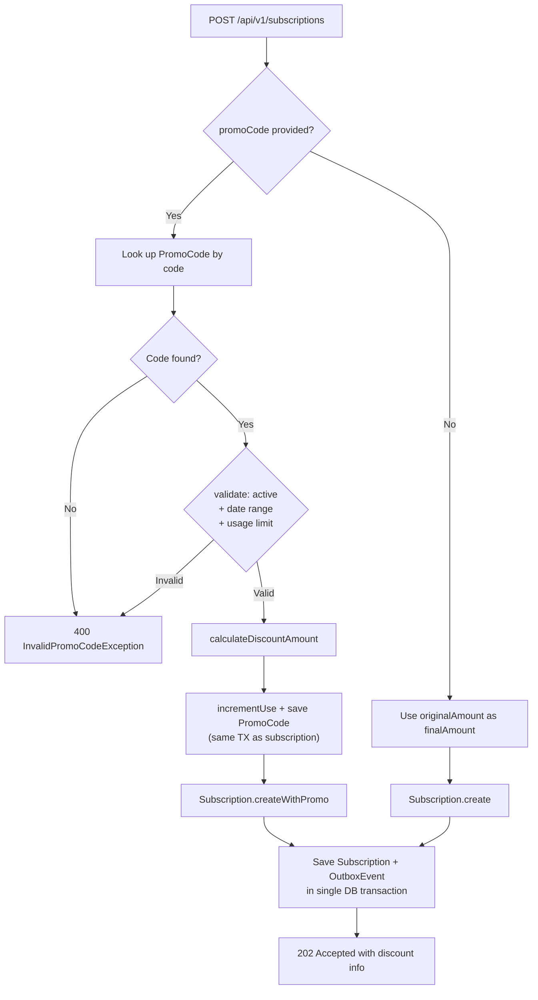

### 18.4 Saga Akışında Promo Kodu / Promo Code in the Saga

Outbox payload `subscription.created.v1` artık üç alanı içerir:

| Alan / Field | Açıklama / Notes |
|-------------|-----------------|
| `amount` | Orijinal plan fiyatı — audit için korunur |
| `discountAmount` | Uygulanan indirim tutarı |
| `finalAmount` | Ödeme servisinin tahsil ettiği tutar |

Payment Service geriye uyumluluk için: `node.has("finalAmount")` kontrolü yaparak `finalAmount` yoksa `amount` değerini kullanır.

### 18.5 Yetki Modeli / Authorization Model

| İşlem / Action | Yetki / Auth |
|---------------|-------------|
| Promo kodu oluştur / Create code | `ROLE_ADMIN` — `@PreAuthorize("hasRole('ADMIN')")` |
| Promo kodu doğrula / Validate code | Public — token gerektirmez / no auth required |
| Promolu abonelik başlat / Subscribe with promo | `ROLE_USER` (normal subscription flow) |

### 18.6 Eşzamanlılık Notu / Concurrency Note

`current_uses` sayacı abonelik oluşturma transaction'ı içinde artırılır. Yüksek eşzamanlılık senaryolarında (aynı anda birden fazla kullanıcı aynı `maxUses` limitine yakın kodla işlem yapıyorsa), `PromoCodeJpaEntity`'e `@Version int version` eklemek suretiyle optimistik kilitleme yapılması önerilir.

---

> **Notlar / Notes:**
>
> Bu çalışma, gerçek üretim sistemlerine benzer belirsizlikler ve kısıtlar içermektedir. Adaydan, tüm problemleri eksiksiz çözmesi değil; **doğru varsayımlar yapması, riskleri fark etmesi ve bilinçli teknik kararlar alması** beklenmektedir.
>
> This case study intentionally mirrors real-world ambiguity. The candidate is expected not to solve everything perfectly, but to **make sound assumptions, identify risks, and take deliberate technical decisions**.
