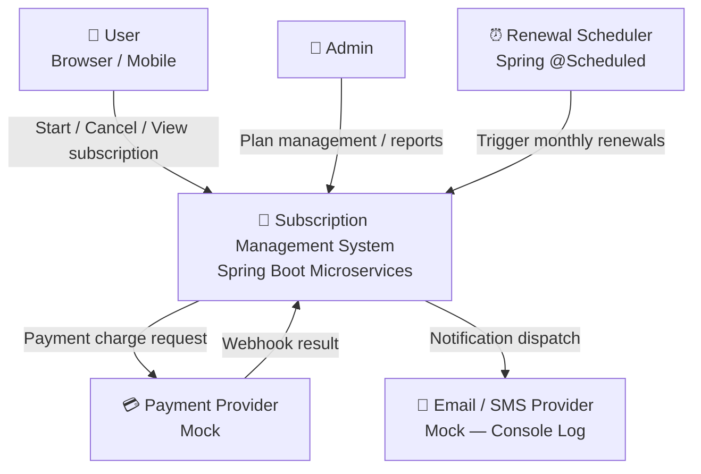
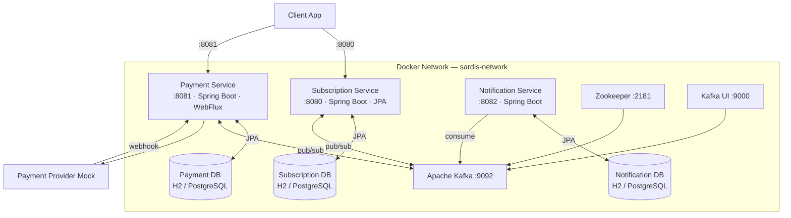
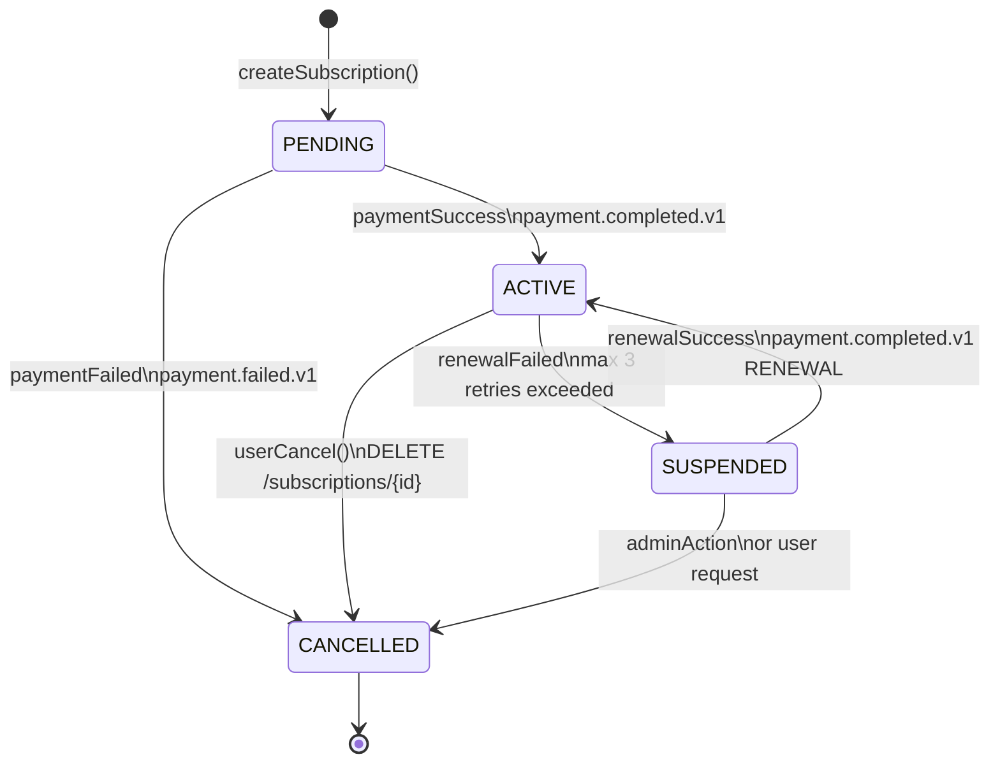
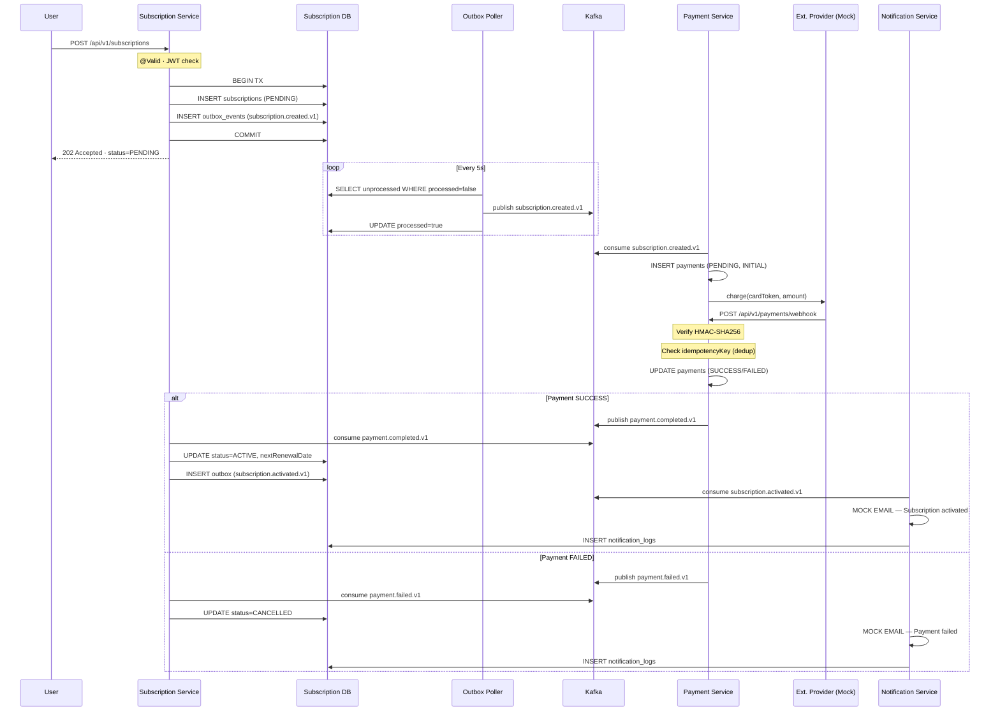
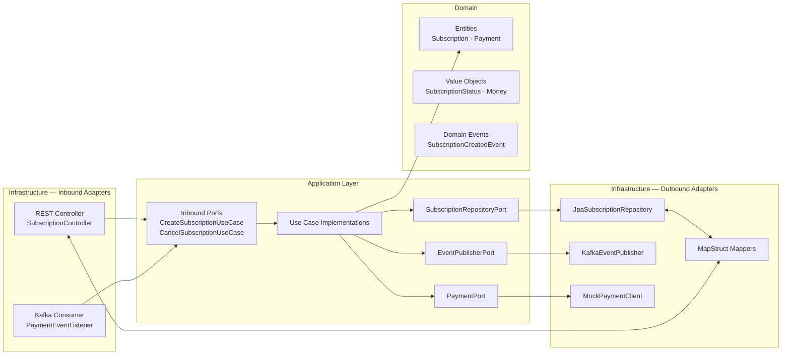
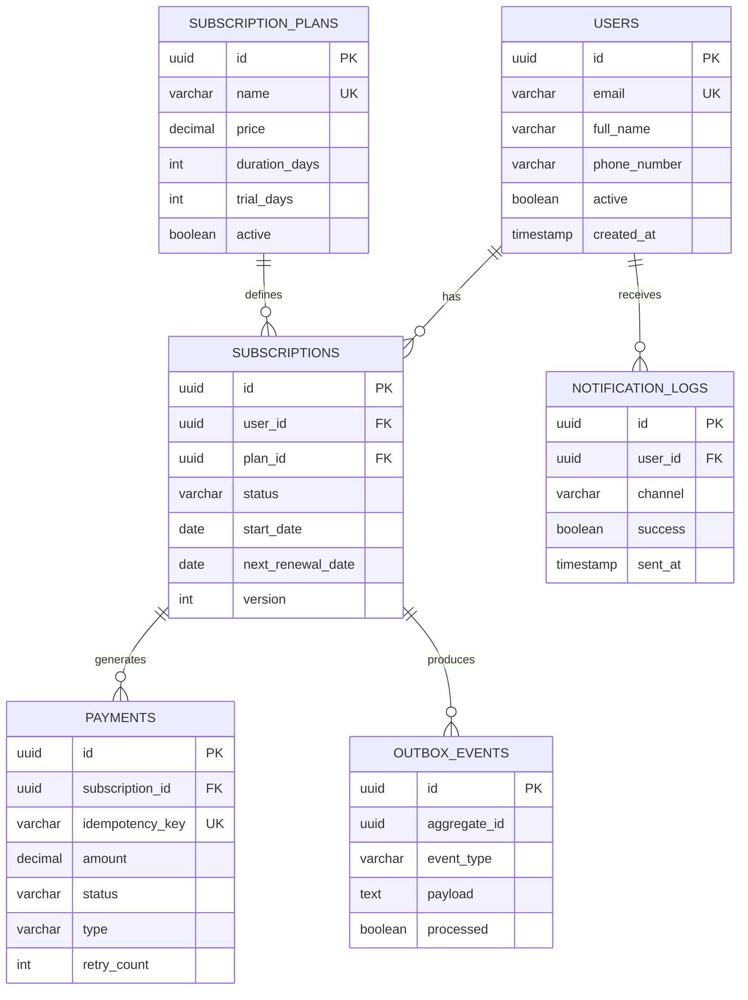

# Subscription Management System

> A distributed subscription management system built with Spring Boot, Apache Kafka, and Hexagonal Architecture — designed for fault tolerance, idempotency, and production readiness.


---

## Overview

Users can start, renew, and cancel subscriptions with credit card payments processed asynchronously via an external provider. The system guarantees consistency through the **Saga Choreography** pattern and the **Transactional Outbox Pattern** — even when downstream services are temporarily unavailable.

| Capability | Detail |
|---|---|
| Async payment | HTTP 202 on creation; state updated via Kafka event |
| Payment gate | Subscription never activates before payment succeeds |
| Auto-renewal | Scheduler runs daily at 09:00; exponential backoff on failure |
| Fault tolerance | Outbox pattern + circuit breaker + retry (Resilience4j) |
| Idempotency | Webhook dedup via `idempotencyKey`; Kafka at-least-once safe |
| Security | JWT Bearer, HMAC-SHA256 webhook signature, no PII in logs |

---

## Architecture

### System Context



### Microservices & Infrastructure



### Subscription State Machine



### Subscription Creation — Saga Sequence



### Hexagonal Architecture (per Service)



### Database ER Diagram



---

## Tech Stack

| Category | Technology | Rationale |
|---|---|---|
| Framework | Spring Boot 4.x | Production-ready ecosystem |
| Language | Java 17 | LTS — records, sealed classes |
| Database | H2 (dev) / PostgreSQL (prod) | Fast local dev + production parity |
| Migrations | Flyway | Versioned, deterministic schema |
| Messaging | Apache Kafka | Fan-out, event replay, at-least-once |
| Architecture | Hexagonal (Ports & Adapters) | Domain isolated; adapters swappable |
| Distributed TX | Saga Choreography + Outbox Pattern | No dual-write problem |
| Mapper | MapStruct | Compile-time, zero reflection |
| Resilience | Resilience4j | Circuit breaker + retry + backoff |
| API Docs | SpringDoc OpenAPI 3 | Auto-generated Swagger UI |
| Testing | JUnit 5 + Mockito + EmbeddedKafka | Full coverage: unit → integration |
| Container | Docker + Docker Compose | Reproducible environment |

---

## Kafka Topics

| Topic | Publisher | Consumers |
|---|---|---|
| `subscription.created.v1` | Subscription Service | Payment Service |
| `subscription.activated.v1` | Subscription Service | Notification Service |
| `subscription.cancelled.v1` | Subscription Service | Notification Service |
| `subscription.failed.v1` | Subscription Service | Notification Service |
| `payment.completed.v1` | Payment Service | Subscription Service, Notification Service |
| `payment.failed.v1` | Payment Service | Subscription Service, Notification Service |
| `renewal.requested.v1` | Subscription Scheduler | Payment Service |

---

## Quick Start

```bash
# Full stack
docker-compose up --build

# Dev mode (H2 in-memory, single module)
./gradlew bootRun --args='--spring.profiles.active=dev'

# Run tests
./gradlew test
```

| URL | Description |
|---|---|
| `http://localhost:8080/swagger-ui.html` | Swagger UI — Subscription Service |
| `http://localhost:8081/swagger-ui.html` | Swagger UI — Payment Service |
| `http://localhost:8080/h2-console` | H2 DB Console (dev) |
| `http://localhost:9000` | Kafka UI |
| `http://localhost:8080/actuator/health` | Health check |

**Demo flow:**

```bash
# 1. Create subscription → 202 PENDING
curl -X POST http://localhost:8080/api/v1/subscriptions \
  -H "Authorization: Bearer <token>" \
  -H "Content-Type: application/json" \
  -d '{"userId":"user-uuid","planId":"plan-uuid","paymentMethod":{"cardToken":"tok_visa"}}'

# 2. Simulate payment webhook (Payment Service)
curl -X POST http://localhost:8081/api/v1/payments/webhook \
  -H "X-Signature: sha256=<hmac>" \
  -H "Content-Type: application/json" \
  -d '{"idempotencyKey":"key-1","status":"SUCCESS","subscriptionId":"sub-uuid","amount":99.99}'

# 3. Check subscription → 200 ACTIVE
curl http://localhost:8080/api/v1/subscriptions/sub-uuid \
  -H "Authorization: Bearer <token>"
```

---

## Documentation

| Document | Location |
|---|---|
| Product Requirements (PRD) | [`claude/prd.md`](claude/prd.md) |
| Architecture Decision Records | [`docs/architecture/ADR.md`](docs/architecture/ADR.md) |
| Subscription Service Design | [`docs/subscription-service/README.md`](docs/subscription-service/README.md) |
| Payment Service Design | [`docs/payment-service/README.md`](docs/payment-service/README.md) |
| Notification Service Design | [`docs/notification-service/README.md`](docs/notification-service/README.md) |

---

## Key Design Decisions

| Decision | Why |
|---|---|
| **Outbox Pattern** | Eliminates dual-write: DB state + Kafka event committed atomically |
| **Saga Choreography** | 3 services — no orchestrator needed; each service reacts to events |
| **`@Version` on Subscription** | Optimistic locking prevents concurrent cancel + renewal race condition |
| **No public `setStatus()`** | State machine enforced in domain entity; invalid transitions throw domain exception |
| **Mock notifications** | Hexagonal `NotificationPort` — swap to SendGrid/Twilio without touching use cases |
| **H2 → PostgreSQL** | Same Flyway migrations run in both; `application.properties` datasource change only |

---

> Author: Ahmet Özyılmaz · mini-sardis / subscription-service
