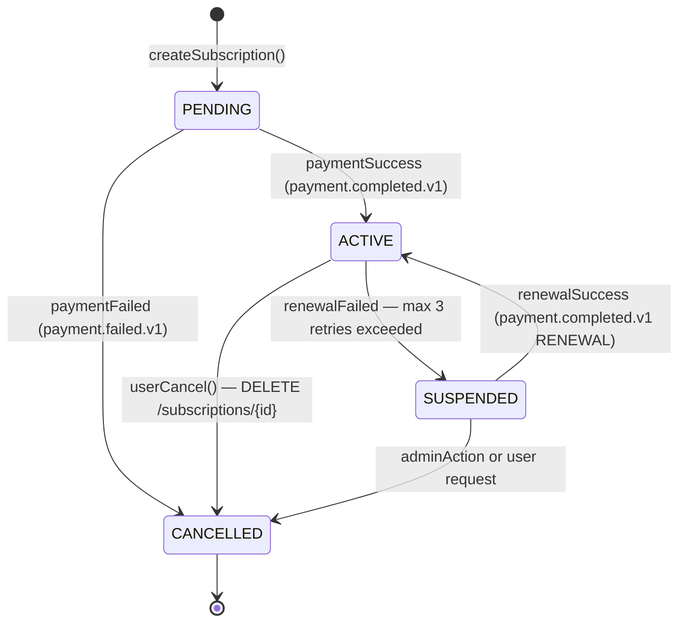

# Subscription Service — Design Document

> **Bounded Context:** Subscription Lifecycle Management  
> **Port:** `:8080`  
> **Responsibilities:** Create, cancel, renew subscriptions; own the subscription state machine; publish domain events via Outbox Pattern.

---

## Table of Contents

1. [Purpose](#1-purpose)
2. [Domain Responsibilities](#2-domain-responsibilities)
3. [Hexagonal Layer Map](#3-hexagonal-layer-map)
4. [Subscription State Machine](#4-subscription-state-machine)
5. [Outbox Pattern](#5-outbox-pattern)
6. [Key Use Cases](#6-key-use-cases)
7. [Inbound Ports (API)](#7-inbound-ports-api)
8. [Outbound Ports](#8-outbound-ports)
9. [Kafka Events Published](#9-kafka-events-published)
10. [Kafka Events Consumed](#10-kafka-events-consumed)
11. [Database Tables](#11-database-tables)
12. [Caching](#12-caching)
13. [Key Design Decisions](#13-key-design-decisions)
14. [Running Locally](#14-running-locally)

---

## 1. Purpose

Subscription Service is the central orchestrator of the subscription lifecycle. It is the **system of record** for subscription state. All other services react to its events — it does not react to commands from others for state transitions.

**This service does:**
- Create, activate, suspend, and cancel subscriptions
- Schedule and trigger periodic renewal events
- Own and enforce the subscription state machine
- Publish reliable domain events via Outbox Pattern

**This service does NOT do:**
- Charge credit cards (Payment Service responsibility)
- Send emails or SMS (Notification Service responsibility)
- Process payment webhooks directly (Payment Service handles these)

---

## 2. Domain Responsibilities

```
Subscription Service
│
├── Subscription CRUD (create, read, cancel)
├── Subscription State Machine (PENDING→ACTIVE→SUSPENDED→CANCELLED)
├── Outbox Event Publisher (subscription.created, activated, cancelled, failed, renewed)
└── Renewal Scheduler (@Scheduled — finds ACTIVE subscriptions due for renewal)
```

**Invariants enforced:**
- A subscription cannot activate without a successful payment event
- A CANCELLED subscription cannot transition to any other state
- A user can have at most one active subscription per plan at a time (enforced at creation)
- `nextRenewalDate` is always set to `startDate + durationDays` on activation

---

## 3. Hexagonal Layer Map

| Layer | Package | Contents |
|-------|---------|----------|
| **Domain** | `domain/entity/` | `Subscription`, `SubscriptionPlan` (pure Java, no annotations) |
| **Domain** | `domain/value/` | `SubscriptionStatus`, `Money`, `PlanId` (immutable value objects) |
| **Domain** | `domain/event/` | `SubscriptionCreatedEvent`, `SubscriptionActivatedEvent`, `SubscriptionCancelledEvent` |
| **Domain** | `domain/service/` | `SubscriptionDomainService` — validation rules, no Spring deps |
| **Application** | `application/port/in/` | `CreateSubscriptionUseCase`, `CancelSubscriptionUseCase`, `GetSubscriptionUseCase` |
| **Application** | `application/port/out/` | `SubscriptionRepositoryPort`, `SubscriptionQueryPort`, `EventPublisherPort` |
| **Application** | `application/service/` | Use case implementations |
| **Infrastructure** | `infrastructure/adapter/in/web/` | `SubscriptionController` (@RestController) |
| **Infrastructure** | `infrastructure/adapter/in/kafka/` | `PaymentResultEventListener` (@KafkaListener) |
| **Infrastructure** | `infrastructure/adapter/in/mapper/` | `SubscriptionRequestMapper`, `SubscriptionResponseMapper` (MapStruct) |
| **Infrastructure** | `infrastructure/adapter/out/jpa/` | `JpaSubscriptionRepository`, `SubscriptionJpaEntity` |
| **Infrastructure** | `infrastructure/adapter/out/kafka/` | `KafkaEventPublisher` |
| **Infrastructure** | `infrastructure/adapter/out/mapper/` | `SubscriptionJpaMapper`, `OutboxEventJpaMapper` (MapStruct) |
| **Infrastructure** | `infrastructure/config/` | `SecurityConfig`, `KafkaConfig`, `CacheConfig`, `OpenAPIConfig` |
| **Infrastructure** | `infrastructure/persistence/` | Flyway migrations (`db/migration/V1–V8`) |

---

## 4. Subscription State Machine



**State transition methods on `Subscription` entity:**

```java
// Encapsulation: no public setStatus()
// Only behavior methods trigger transitions

public void activate(LocalDate startDate, int durationDays) {
    validateTransition(ACTIVE);
    this.status = ACTIVE;
    this.startDate = startDate;
    this.nextRenewalDate = startDate.plusDays(durationDays);
    this.addDomainEvent(new SubscriptionActivatedEvent(this.id));
}

public void cancel(String reason) {
    validateTransition(CANCELLED);
    this.status = CANCELLED;
    this.cancelledAt = LocalDateTime.now();
    this.cancellationReason = reason;
    this.addDomainEvent(new SubscriptionCancelledEvent(this.id));
}

public void suspend() {
    validateTransition(SUSPENDED);
    this.status = SUSPENDED;
}

private void validateTransition(SubscriptionStatus target) {
    if (!ALLOWED_TRANSITIONS.get(this.status).contains(target)) {
        throw new InvalidStateTransitionException(this.status, target);
    }
}
```

---

## 5. Outbox Pattern

The Outbox Pattern guarantees that domain events reach Kafka even if Kafka is temporarily unavailable.

```
┌─────────────────────────────────────────┐
│         Single DB Transaction            │
│                                          │
│  1. INSERT subscriptions (PENDING)       │
│  2. INSERT outbox_events (created.v1)    │
│                                          │
│  COMMIT                                  │
└──────────────────┬──────────────────────┘
                   │
         ┌─────────▼──────────┐
         │  OutboxPoller       │  ← @Scheduled every 5s
         │  SELECT unprocessed │
         │  FOR UPDATE SKIP LOCKED (PostgreSQL)
         └─────────┬──────────┘
                   │
         ┌─────────▼──────────┐
         │  Kafka publish      │
         │  subscription.created.v1
         └─────────┬──────────┘
                   │
         ┌─────────▼──────────┐
         │  UPDATE processed=true
         └────────────────────┘
```

**Key property:** If the OutboxPoller crashes between publish and marking processed, the event is re-published on next poll. Consumers handle this via idempotency key (at-least-once semantic).

---

## 6. Key Use Cases

| Use Case | Trigger | Action |
|----------|---------|--------|
| `CreateSubscriptionUseCase` | `POST /api/v1/subscriptions` | Validate user+plan, INSERT PENDING + outbox |
| `CancelSubscriptionUseCase` | `DELETE /api/v1/subscriptions/{id}` | transition ACTIVE→CANCELLED + outbox |
| `GetSubscriptionUseCase` | `GET /api/v1/subscriptions/{id}` | Read from DB (no cache) |
| `ListSubscriptionsUseCase` | `GET /api/v1/subscriptions?userId=` | Paginated list |
| `HandlePaymentResultUseCase` | `payment.completed/failed.v1` Kafka event | PENDING→ACTIVE or PENDING→CANCELLED |
| `HandleRenewalResultUseCase` | `payment.completed/failed.v1` RENEWAL event | extend date or ACTIVE→SUSPENDED |
| `ScheduleRenewalUseCase` | `@Scheduled` cron | INSERT outbox events for due subscriptions |

---

## 7. Inbound Ports (API)

| Method | Path | Request | Response | Auth |
|--------|------|---------|----------|------|
| `POST` | `/api/v1/subscriptions` | `CreateSubscriptionRequest` | `202 SubscriptionResponse` | USER |
| `GET` | `/api/v1/subscriptions/{id}` | — | `200 SubscriptionResponse` | USER |
| `DELETE` | `/api/v1/subscriptions/{id}` | — | `200` | USER |
| `GET` | `/api/v1/subscriptions?userId={id}` | — | `200 Page<SubscriptionResponse>` | USER |

---

## 8. Outbound Ports

| Port | Interface | Adapter |
|------|-----------|---------|
| `SubscriptionRepositoryPort` | `save(Subscription)`, `findById(UUID)`, `findDueRenewals(Pageable)` | `JpaSubscriptionRepository` |
| `SubscriptionQueryPort` | `findByUserId(UUID, Pageable)` | `JpaSubscriptionRepository` |
| `EventPublisherPort` | `publish(OutboxEvent)` | `JpaOutboxRepository` (Outbox writes to DB) |

---

## 9. Kafka Events Published

| Topic | Trigger | Payload |
|-------|---------|---------|
| `subscription.created.v1` | New subscription created | `{subscriptionId, userId, planId, amount}` |
| `subscription.activated.v1` | Payment succeeded → ACTIVE | `{subscriptionId, userId, startDate, nextRenewalDate}` |
| `subscription.cancelled.v1` | User cancelled | `{subscriptionId, userId, cancelledAt, reason}` |
| `subscription.failed.v1` | Payment failed → CANCELLED | `{subscriptionId, userId, reason}` |
| `subscription.suspended.v1` | Renewal max retries → SUSPENDED | `{subscriptionId, userId}` |
| `subscription.renewed.v1` | Renewal payment success | `{subscriptionId, userId, newRenewalDate}` |
| `renewal.requested.v1` | Scheduler triggers renewal | `{subscriptionId, planId, amount}` |

All events published via Outbox Pattern — guaranteed delivery.

---

## 10. Kafka Events Consumed

| Topic | Consumer Group | Handler |
|-------|---------------|---------|
| `payment.completed.v1` | `subscription-payment-result` | `HandlePaymentResultUseCase` |
| `payment.failed.v1` | `subscription-payment-result` | `HandlePaymentResultUseCase` |

Handler determines `type` (INITIAL vs RENEWAL) from event payload to route to correct state transition.

---

## 11. Database Tables

| Table | Purpose |
|-------|---------|
| `subscriptions` | Primary subscription records + state + optimistic lock version |
| `subscription_plans` | Available plans (cached; rarely changes) |
| `outbox_events` | Transactional outbox for Kafka event publication |
| `users` | User records (referenced by subscriptions) |

**Key index:** `idx_subscriptions_renewal ON subscriptions(status, next_renewal_date)` — used by the renewal scheduler query.

---

## 12. Caching

| Cache | Key | TTL | Eviction |
|-------|-----|-----|---------|
| `plans` | all | 10 min | `@CacheEvict` on plan deactivate/update |
| `plan` | `plan:{id}` | 10 min | `@CacheEvict(key="#id")` |

**NOT cached:** Subscription status — changes via async Kafka events; stale status is a billing risk.

---

## 13. Key Design Decisions

| Decision | Rationale |
|----------|-----------|
| Outbox over direct Kafka publish | Dual-write problem — DB write + Kafka publish are NOT atomic without outbox |
| Saga choreography over orchestration | 3 services; choreography is simpler and avoids central coupling point |
| `@Version` on Subscription | Concurrent renewal + cancel could race — optimistic lock ensures consistent final state |
| No public `setStatus()` | State machine enforced in entity; invalid transitions throw domain exception |
| Separate `SubscriptionRepositoryPort` and `SubscriptionQueryPort` | Interface segregation — write use cases don't inject read methods |

---

## 14. Running Locally

```bash
# Full stack with Docker Compose (from project root)
docker-compose up --build

# Dev mode (H2, single Spring Boot module)
./gradlew bootRun --args='--spring.profiles.active=dev'

# API available at
curl http://localhost:8080/swagger-ui.html

# H2 Console
open http://localhost:8080/h2-console
# JDBC URL: jdbc:h2:mem:subscriptiondb
# Username: sa / Password: (empty)

# Health check
curl http://localhost:8080/actuator/health

# Run tests
./gradlew test
```

**Demo flow (curl):**

```bash
# 1. Create subscription
curl -X POST http://localhost:8080/api/v1/subscriptions \
  -H "Authorization: Bearer <token>" \
  -H "Content-Type: application/json" \
  -d '{"userId":"user-uuid","planId":"plan-uuid","paymentMethod":{"cardToken":"tok_visa"}}'
# → 202 PENDING

# 2. Simulate payment webhook
curl -X POST http://localhost:8081/api/v1/payments/webhook \
  -H "X-Signature: sha256=<hmac>" \
  -H "Content-Type: application/json" \
  -d '{"idempotencyKey":"key-1","status":"SUCCESS","subscriptionId":"sub-uuid"}'

# 3. Check subscription status
curl http://localhost:8080/api/v1/subscriptions/sub-uuid \
  -H "Authorization: Bearer <token>"
# → 200 ACTIVE
```
